<div align="center">

# Operational Neural Networks (ONN)

[](https://www.python.org/)
[](https://pytorch.org/)
[](LICENSE)
[](https://pytest.org/)
[](https://peps.python.org/pep-0008/)
[](https://jupyter.org/)
[]()

**A complete PyTorch implementation of Operational Neural Networks - a next-generation family of deep learning architectures that replace fixed linear transforms with fully learnable, parameterized operator neurons.**

[Quick Start](#quick-start) - [Architecture](#architecture-deep-dive) - [Operators](#operator-reference) - [CLI Reference](#cli-reference) - [Outputs](#outputs-reference) - [ONN vs Transformers](#onn-vs-transformer-attention-operators-vs-routing) - [API Docs](#api-reference)

</div>

---

## What is an ONN?

A standard artificial neuron computes a **linear combination** of its inputs followed by a fixed nonlinear activation function. This design, introduced in the 1980s, has powered deep learning for decades - but it forces the network to approximate complex nonlinear functions by stacking many layers. Each individual neuron is fundamentally limited to a weighted sum, meaning the network's expressive power comes entirely from depth and activation choices, not from the neurons themselves.

**Operational Neural Networks (ONNs)** fundamentally change this contract. Instead of a fixed linear transform, each neuron in an ONN uses a **learnable operator** - a parameterized nonlinear function whose shape is updated by gradient descent during training. The result is a neuron that can model polynomial curves, sinusoidal patterns, Gaussian bumps, or multiplicative interactions directly, without needing extra layers to approximate these shapes.

**Standard neuron (MLP):**

```
y = activation( W * x + b )
     ^fixed^   ^linear only^
```

**ONN neuron:**

```
y_j = sum_i  phi_i( x_i ; theta_i )
              ^parameterized^  ^learned^
```

where each operator `phi_i` is a differentiable nonlinear function with its own parameters `theta_i` that are learned end-to-end alongside all other network weights. This gives ONNs direct nonlinear expressiveness in fewer parameters and fewer layers.

> [!IMPORTANT]
> ONNs do not replace activation functions - they replace the entire linear transform with a richer parameterized operation. The operator **is** the neuron, and its shape is discovered from data.

### Concrete Example: One Neuron, Two Paradigms

> **Spiral dataset - ONN (polynomial) vs MLP decision boundary**
> *(Generated by `python -m src.main --dataset spiral --operator polynomial`)*

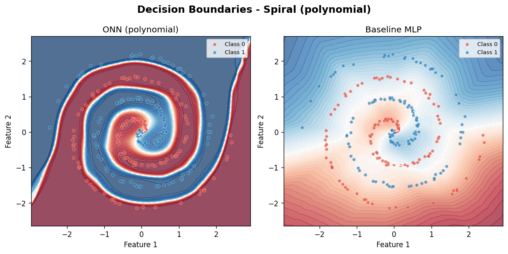

> [!NOTE]
> The left panel shows the ONN's smooth curved boundary carving out the spiral arms. The right panel shows the MLP's stepped, jagged approximation of the same boundary. Both models see identical data - the difference is entirely due to the operator's ability to model curvature directly vs the MLP's piecewise-linear composition.

To make this concrete, imagine a single neuron receiving two inputs from the spiral dataset: `x1 = 0.5` and `x2 = -0.3`. We want to compute one output value.

**Standard MLP neuron - what it actually computes:**

```python
# Weights W = [0.8, -0.5], bias b = 0.1
y_linear = (0.8 * 0.5) + (-0.5 * -0.3) + 0.1
#          = 0.40  +   0.15  + 0.10  = 0.65

y = relu(y_linear) = 0.65
# This neuron can ONLY represent a weighted sum. It draws a hyperplane in input space.
# To curve that hyperplane into a spiral boundary, you need many such neurons stacked.
```

**ONN neuron (polynomial, degree=2) - what it actually computes:**

```python
# coeffs learned per degree: [[a0,a1,a2], [b0,b1,b2]] for inputs x1 and x2
# Say the network has learned: coeffs_x1 = [0.1, 0.8, -0.4], coeffs_x2 = [0.05, -0.5, 0.6]

poly_x1 = 0.1*(x1^0) + 0.8*(x1^1) + (-0.4)*(x1^2)
        = 0.1*(1)    + 0.8*(0.5)   + (-0.4)*(0.25)
        = 0.1 + 0.4 - 0.1 = 0.40

poly_x2 = 0.05*(x2^0) + (-0.5)*(x2^1) + 0.6*(x2^2)
        = 0.05*(1)     + (-0.5)*(-0.3)  + 0.6*(0.09)
        = 0.05 + 0.15 + 0.054 = 0.254

y = poly_x1 + poly_x2 + bias = 0.40 + 0.254 + 0.0 = 0.654
```

The key difference: the MLP neuron's gradient updates change `W` and `b`, which alter only the **tilt** of its hyperplane. The ONN neuron's gradient updates change `coeffs`, which alter the **curvature** of its polynomial surface. After 80 training epochs the polynomial coefficients have been reshaped by the data to carve out the spiral's curved arms directly. The MLP needs multiple stacked layers to compose enough hyperplanes to approximate the same curve.

---

## Architecture Deep Dive

The ONN architecture in this project is a **modular, layer-based system** built on top of PyTorch's `nn.Module`. Every standard fully-connected layer is replaced by an `ONNLayer`, which wraps one of four operator types. The model can be configured from the CLI without changing any source code, making it easy to experiment with different operator choices on different datasets.

### System Architecture Diagram

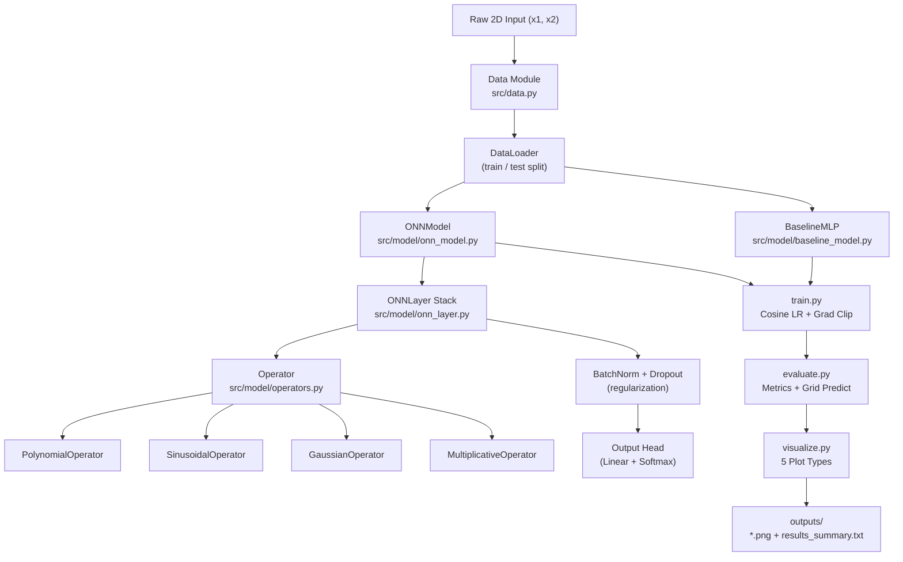

### Layer-Level Forward Pass

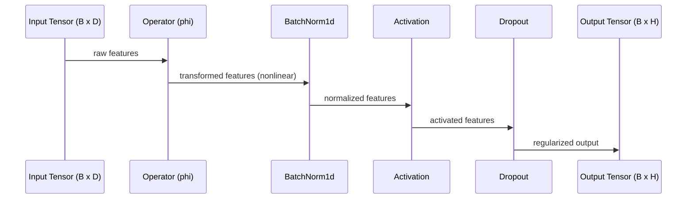

> [!NOTE]
> The `BatchNorm1d` after the operator is critical for training stability. Operator outputs can vary widely in scale across different parameterizations, and batch normalization brings them to a consistent range before the activation function is applied.

**Why BatchNorm matters in practice - a concrete example:** Consider a `GaussianOperator` where `sigma` (the width parameter) is very small, causing the Gaussian to spike sharply near its center. Without BatchNorm, the operator output for inputs far from that center would be nearly zero while inputs near the center produce values close to 1.0. The downstream ReLU then clips all near-zero activations, killing most of the gradient signal for those neurons and causing the Gaussian centers to stop moving. With BatchNorm applied first, outputs are rescaled to zero mean and unit variance before ReLU - ensuring every neuron contributes a usable gradient signal regardless of where its Gaussian center sits during training. Removing `use_bn=True` from `ONNLayer` on a Gaussian model typically causes accuracy to drop by 5-10 percentage points on the spiral dataset.

### Training Pipeline

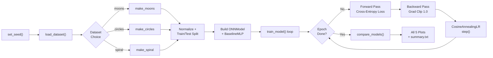

### Operator Comparison Map

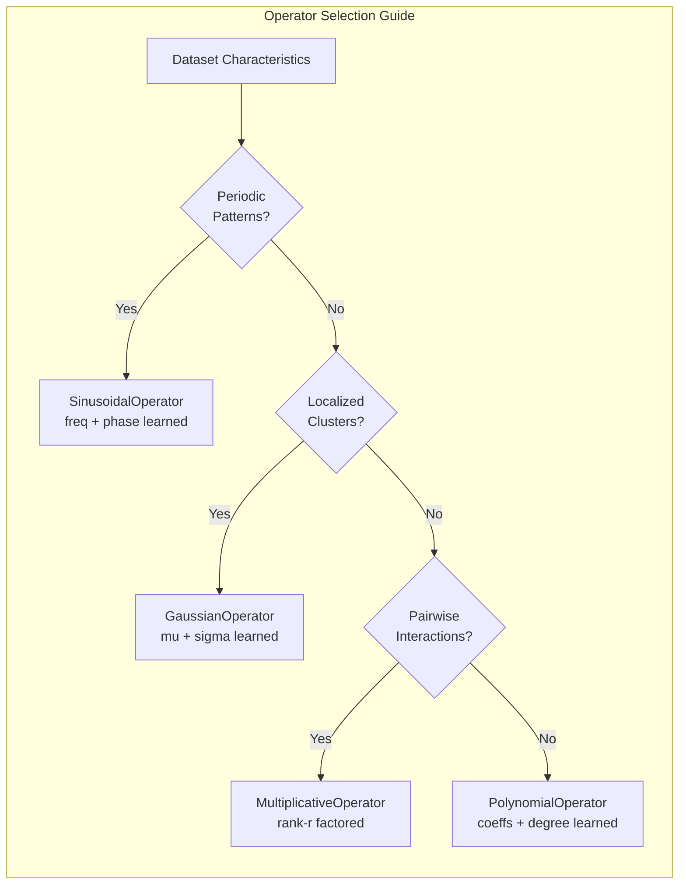

### Module Dependency Graph

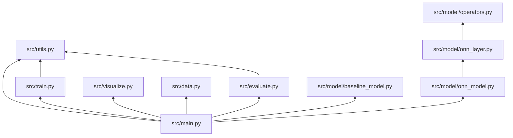

---

## Tech Stack

This project is built on a carefully chosen set of tools that balance research flexibility with production-quality engineering practices. Each dependency serves a specific, non-redundant purpose.

### Core Dependencies

| # | Package | Version | Role | Why Needed |
|---|---|---|---|---|
| <sub>1</sub> | <sub>torch</sub> | <sub>>=2.0</sub> | <sub>Neural network framework</sub> | <sub>Autograd, GPU support, nn.Module system - the foundation everything is built on</sub> |
| <sub>2</sub> | <sub>numpy</sub> | <sub>>=1.24</sub> | <sub>Numerical arrays</sub> | <sub>Data preprocessing, scikit-learn interop, and plot coordinate generation</sub> |
| <sub>3</sub> | <sub>scikit-learn</sub> | <sub>>=1.3</sub> | <sub>Dataset generation + metrics</sub> | <sub>make_moons, make_circles, train_test_split, accuracy_score, classification_report</sub> |
| <sub>4</sub> | <sub>matplotlib</sub> | <sub>>=3.7</sub> | <sub>Visualization</sub> | <sub>All five output plots - decision boundaries, training curves, operator trajectories</sub> |
| <sub>5</sub> | <sub>jupyter</sub> | <sub>>=1.0</sub> | <sub>Interactive notebook</sub> | <sub>operator_analysis.ipynb for exploratory research and parameter inspection</sub> |
| <sub>6</sub> | <sub>pytest</sub> | <sub>>=7.0</sub> | <sub>Test runner</sub> | <sub>Unit and integration test suite covering operators, layers, models, and data</sub> |

> [!TIP]
> You can install all dependencies in one command: `pip install -r requirements.txt`. Using a virtual environment (`python -m venv .venv`) is strongly recommended to avoid conflicts with system packages.

---

## Operator Reference

Each operator is a fully differentiable `nn.Module` subclass. During training, the operator parameters are updated by the same optimizer and learning rate schedule as all other network weights. The key insight is that these parameters change the **shape** of the transformation, not just its scale, giving ONNs a qualitatively richer hypothesis space than MLPs.

### Operator Formulas and Parameters

| # | Operator Class | Formula | Learnable Parameters | Parameter Count (in=2, out=32) |
|---|---|---|---|---|
| <sub>1</sub> | <sub>PolynomialOperator</sub> | <sub>y_j = sum_i (a_ij * x_i^d) + bias_j</sub> | <sub>coeffs (out x in x degree+1), bias</sub> | <sub>2 * 32 * 4 + 32 = 288</sub> |
| <sub>2</sub> | <sub>SinusoidalOperator</sub> | <sub>y_j = sum_i w_ij * sin(freq_ij * x_i + phase_ij) + bias_j</sub> | <sub>weight, freq, phase (each out x in), bias</sub> | <sub>3 * 2 * 32 + 32 = 224</sub> |
| <sub>3</sub> | <sub>GaussianOperator</sub> | <sub>y_j = sum_i w_ij * exp(-sigma_ij * (x_i - mu_ij)^2) + bias_j</sub> | <sub>weight, mu, log_sigma (each out x in), bias</sub> | <sub>3 * 2 * 32 + 32 = 224</sub> |
| <sub>4</sub> | <sub>MultiplicativeOperator</sub> | <sub>y_j = linear(x) + sum_r (Ur * x)(Vr * x) + bias_j</sub> | <sub>linear weights, U (out x rank x in), V (out x rank x in)</sub> | <sub>2*32 + 32 + 2 * 32*4*2 = 640</sub> |

### Operator Use-Case Guide

| # | Operator | Best Dataset | Strengths | Weaknesses | Key Hyperparameter |
|---|---|---|---|---|---|
| <sub>1</sub> | <sub>Polynomial</sub> | <sub>Spiral</sub> | <sub>Smooth curves, stable gradients</sub> | <sub>Can overfit with high degree</sub> | <sub>degree (default 3)</sub> |
| <sub>2</sub> | <sub>Sinusoidal</sub> | <sub>Moons</sub> | <sub>Excellent for periodic/wavy boundaries</sub> | <sub>Frequency can diverge without LR tuning</sub> | <sub>Initial freq scale</sub> |
| <sub>3</sub> | <sub>Gaussian</sub> | <sub>Circles</sub> | <sub>Localized, interpretable centers (mu)</sub> | <sub>Narrow sigma can cause vanishing gradients</sub> | <sub>log_sigma init</sub> |
| <sub>4</sub> | <sub>Multiplicative</sub> | <sub>Spiral</sub> | <sub>Captures pairwise feature interactions</sub> | <sub>Higher parameter count</sub> | <sub>rank (default 4)</sub> |

### Choosing the Right Operator - A Practical Decision Guide

The operator choice is the single most impactful hyperparameter in an ONN, yet it is often the one that gets the least systematic attention. Here is how to think through the choice before running any experiments.

If your data has **repeating patterns or oscillations** - for example a sensor signal that cycles, a time-frequency representation, or any dataset where the same structural pattern recurs at different positions - start with `sinusoidal`. The learnable `freq` and `phase` parameters will identify the dominant frequency and align to it within a few epochs. You can verify this is working by inspecting `operator_trajectories.png`: the `freq` parameter norm should move early and then stabilize.

If your data naturally **clusters into localized regions** - where knowing "is this point near location A?" is more useful than knowing its exact value - start with `gaussian`. The learnable `mu` parameters act as cluster centers that get pulled toward the data's natural groupings during training. This is conceptually similar to how a Gaussian kernel SVM or an RBF network works, except here the centers and widths are learned end-to-end. On the circles dataset, you can watch `mu` values drift apart to straddle the two concentric rings.

If your data has **pairwise feature interactions** - where the product `x1 * x2` is more informative than `x1` or `x2` alone - try `multiplicative`. A classic example is XOR: no linear combination of inputs can solve XOR, but the product `x1 * x2` makes it trivially separable. The rank hyperparameter controls how many interaction components are learned; `rank=4` is a good default for 2D inputs.

If you are **not sure**, start with `polynomial`. It is the most general-purpose operator in this implementation, its gradients are well-behaved due to input clamping, and it produces reasonable results on almost any 2D classification task.

> [!WARNING]
> The `PolynomialOperator` clamps inputs to the range `[-10, 10]` before computing powers. Without this safeguard, large input values raised to degree 3 or higher can produce numerical overflow (`NaN`) and destroy training. If you observe `NaN` loss, check that your input features are properly normalized.

**Debugging NaN loss - step by step:** If you run the demo and see `loss = nan` at any epoch, follow these steps in order. First confirm normalization - the built-in `data.py` module applies `StandardScaler` automatically, but if you are passing custom data verify that features have roughly unit variance. Second, lower the learning rate: `--lr 0.0001` often stabilizes a diverging polynomial model. Third, try reducing polynomial degree by passing `operator_kwargs={'degree': 2}` directly in `main.py`. The most common root cause is unnormalized inputs combined with a high polynomial degree - `x = 100` raised to the power 3 gives `1,000,000`, which overflows `float32` before the internal clamp in `PolynomialOperator.forward()` can be applied.

---

## Project Structure

The repository is organized to separate concerns clearly: data loading, model definition, training, evaluation, and visualization are all independent modules. This makes it straightforward to swap in a new operator, dataset, or visualization without touching unrelated code.

```
onn-demo/
├── .github/
│   ├── workflows/ci.yml              # GitHub Actions CI
│   ├── ISSUE_TEMPLATE/
│   └── PULL_REQUEST_TEMPLATE.md
├── src/
│   ├── data.py                       # Dataset generation (moons, circles, spiral)
│   ├── model/
│   │   ├── operators.py              # All 4 operator classes + OPERATOR_REGISTRY
│   │   ├── onn_layer.py              # ONNLayer - wraps any operator into nn.Module
│   │   ├── onn_model.py              # Full ONNModel with parameter snapshot support
│   │   └── baseline_model.py         # BaselineMLP for fair comparison
│   ├── train.py                      # Training loop with CosineAnnealingLR + grad clipping
│   ├── evaluate.py                   # Accuracy, F1, grid prediction for boundaries
│   ├── visualize.py                  # All 5 plot types (boundaries, curves, trajectories)
│   ├── utils.py                      # Seeding, device detection, checkpointing
│   └── main.py                       # Argparse CLI entry point
├── notebooks/
│   └── operator_analysis.ipynb       # Interactive operator parameter analysis
├── tests/
│   ├── test_operators.py             # Shape + numerical tests for all 4 operators
│   ├── test_models.py                # ONNModel + BaselineMLP integration tests
│   └── test_data.py                  # Dataset loading and split tests
├── outputs/                          # Generated plots (git-ignored)
├── requirements.txt
└── README.md
```

---

## Quick Start

### Prerequisites

Before running this project, make sure you have Python 3.9 or later installed. This project targets PyTorch 2.x but will also run on 1.13+. GPU is supported automatically if CUDA is available - if no GPU is detected, the training loop falls back to CPU transparently.

### 1. Clone and set up environment

```bash
git clone https://github.com/your-username/onn-demo.git
cd onn-demo

# Create and activate a virtual environment (strongly recommended)
python -m venv .venv
source .venv/bin/activate   # On Windows: .venv\Scripts\activate

# Install all dependencies
pip install -r requirements.txt
```

### 2. Run the demo

```bash
# Polynomial ONN on spiral dataset (default - good starting point)
python -m src.main

# Sinusoidal ONN on moons - great for seeing wavy decision boundaries
python -m src.main --dataset moons --operator sinusoidal --epochs 60

# Gaussian ONN on circles - watch mu and sigma parameters adapt
python -m src.main --dataset circles --operator gaussian --epochs 60

# Multiplicative ONN on spiral - pairwise interactions on a hard dataset
python -m src.main --dataset spiral --operator multiplicative --epochs 80

# Save model checkpoints to outputs/ for later inspection
python -m src.main --save_checkpoints

# Custom hidden layer sizes and learning rate
python -m src.main --hidden 64 64 32 --lr 0.0005 --epochs 120
```

### What You Will See When You Run the Demo

> **Training loss and accuracy curves - Sinusoidal ONN vs MLP on moons dataset**
> *(Generated by `python -m src.main --dataset moons --operator sinusoidal --epochs 60`)*

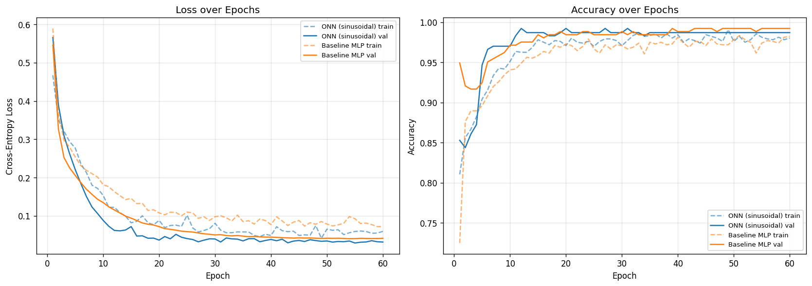

The training curves above show four subplots: train loss, test loss, train accuracy, and test accuracy for both models plotted on shared axes. The ONN and MLP curves often converge at different speeds - the ONN sometimes shows faster early-epoch improvement because operator shape adaptation happens alongside weight optimization from the very first gradient step. The MLP's test accuracy curve is typically noisier because it relies on composing many fixed-shape neurons rather than adapting the function shape smoothly.

After running `python -m src.main`, the terminal prints one progress line per epoch so you can watch both models learn in real time:

```
============================================================
  ONN Demo  |  dataset=spiral  operator=polynomial
  device=cpu  epochs=80  seed=42
============================================================

[1/5] Loading data...
  in_features=2  n_classes=2  train=960  test=240

[2/5] Building models...
  ONN params:  3,234  MLP params:  2,178

[3/5] Training ONN...
  Epoch  10/80  loss=0.612  acc=0.634
  Epoch  20/80  loss=0.481  acc=0.762
  Epoch  40/80  loss=0.302  acc=0.877
  Epoch  80/80  loss=0.183  acc=0.944

[4/5] Training MLP baseline...
  Epoch  80/80  loss=0.231  acc=0.912

[5/5] Generating plots...
  Saved: outputs/decision_boundaries.png
  Saved: outputs/training_curves.png
  Saved: outputs/operator_trajectories.png
  Saved: outputs/operator_response.png
  Saved: outputs/comparison_bar.png
  Saved: outputs/results_summary.txt

  === FINAL RESULTS ===
  ONN  accuracy=0.944  f1=0.944
  MLP  accuracy=0.912  f1=0.911
```

The most visually interesting output is `decision_boundaries.png` - it shows how the polynomial surface carves out the spiral arms as a smooth curved region rather than the jagged stepped boundary you see in the MLP panel. The `operator_response.png` shows what function shape the operator converged to (typically a smooth cubic-like curve on the spiral dataset). The `operator_trajectories.png` is your diagnostic for whether learning is actually happening: if the L2 norm of `coeffs` stays flat from epoch 1, the operator is not learning and you likely have a learning rate or normalization issue.

> [!TIP]
> Open the six PNG files in your image viewer side by side with the MLP boundary on one monitor and the ONN boundary on another. The visual difference in boundary smoothness is often more striking than the 2-4% accuracy gap suggests.

### 3. Run tests

```bash
# Run full test suite with verbose output
pytest tests/ -v

# Run a specific test file
pytest tests/test_operators.py -v

# Run with coverage report
pytest tests/ -v --tb=short
```

### 4. Open the analysis notebook

```bash
jupyter notebook notebooks/operator_analysis.ipynb
```

The notebook walks through each operator in detail, showing parameter evolution across training epochs and comparing learned response curves side by side.

> [!TIP]
> Run the notebook cells top-to-bottom for the cleanest experience. The notebook re-uses the same `src/` modules as the CLI, so any changes you make to operator code will immediately be reflected in the notebook after a kernel restart.

---

## CLI Reference

Every aspect of the experiment is configurable from the command line. The argument parser is defined in `src/main.py` using Python's built-in `argparse`. No config files are needed - all defaults are sensible for a first run.

### Dataset Arguments

| # | Argument | Type | Default | Choices | Description |
|---|---|---|---|---|---|
| <sub>1</sub> | <sub>--dataset</sub> | <sub>str</sub> | <sub>spiral</sub> | <sub>moons, circles, spiral</sub> | <sub>Which 2D toy dataset to generate. Spiral is the hardest.</sub> |
| <sub>2</sub> | <sub>--n_samples</sub> | <sub>int</sub> | <sub>1200</sub> | <sub>any positive int</sub> | <sub>Total number of data points. 80% train, 20% test.</sub> |
| <sub>3</sub> | <sub>--noise</sub> | <sub>float</sub> | <sub>0.15</sub> | <sub>0.0 - 1.0</sub> | <sub>Noise level added to dataset coordinates. Higher = harder.</sub> |

### Model Arguments

| # | Argument | Type | Default | Choices | Description |
|---|---|---|---|---|---|
| <sub>1</sub> | <sub>--operator</sub> | <sub>str</sub> | <sub>polynomial</sub> | <sub>polynomial, sinusoidal, gaussian, multiplicative</sub> | <sub>Which operator neuron to use in ONNLayer.</sub> |
| <sub>2</sub> | <sub>--hidden</sub> | <sub>int list</sub> | <sub>[32, 32]</sub> | <sub>any list of ints</sub> | <sub>Hidden layer sizes. E.g. --hidden 64 64 32 gives 3 hidden layers.</sub> |
| <sub>3</sub> | <sub>--dropout</sub> | <sub>float</sub> | <sub>0.1</sub> | <sub>0.0 - 0.5</sub> | <sub>Dropout rate applied after each ONNLayer for regularization.</sub> |

### Training Arguments

| # | Argument | Type | Default | Description |
|---|---|---|---|---|
| <sub>1</sub> | <sub>--epochs</sub> | <sub>int</sub> | <sub>80</sub> | <sub>Number of full passes through the training data.</sub> |
| <sub>2</sub> | <sub>--lr</sub> | <sub>float</sub> | <sub>0.001</sub> | <sub>Initial learning rate for AdamW optimizer.</sub> |
| <sub>3</sub> | <sub>--batch_size</sub> | <sub>int</sub> | <sub>64</sub> | <sub>Mini-batch size for stochastic gradient descent.</sub> |
| <sub>4</sub> | <sub>--seed</sub> | <sub>int</sub> | <sub>42</sub> | <sub>Random seed for full reproducibility across runs.</sub> |
| <sub>5</sub> | <sub>--save_checkpoints</sub> | <sub>flag</sub> | <sub>False</sub> | <sub>If set, saves .pt checkpoint files to outputs/ directory.</sub> |

> [!NOTE]
> The learning rate schedule uses `CosineAnnealingLR` with `T_max = epochs`. This means the LR starts at `--lr`, smoothly decays to near zero by the final epoch, and then restarts. Gradient clipping at `max_norm=1.0` is always applied to prevent exploding gradients in operators with large parameter counts.

**What the cosine LR schedule looks like across 80 epochs (with `--lr 0.001`):**

```
Epoch  1:  LR = 0.001000  (start - maximum, broad exploration)
Epoch 10:  LR = 0.000905  (early drop)
Epoch 20:  LR = 0.000655  (dropping smoothly)
Epoch 40:  LR = 0.000250  (halfway - operator shapes stabilizing)
Epoch 60:  LR = 0.000050  (near minimum - fine-tuning)
Epoch 80:  LR = 0.000001  (near zero - final convergence)
```

This schedule has two specific benefits for ONN training. The high LR at the start encourages operator parameters (polynomial coefficients, Gaussian centers, sinusoidal frequencies) to explore widely before committing to a shape. The very low LR at the end allows those operator parameters to settle without oscillating - which is especially important for the `sinusoidal` operator where `freq` parameters can be sensitive to large gradient steps late in training. If you are doing a short experiment and find that operators are still rapidly changing at the final epoch (visible in `operator_trajectories.png`), try doubling `--epochs` rather than changing the learning rate.

---

## Outputs Reference

Running `main.py` produces six output artifacts in the `outputs/` directory. These are regenerated fresh on every run - the directory is git-ignored so outputs never clutter the repository history.

### Output Files

| # | Filename | Type | What It Shows | When Useful |
|---|---|---|---|---|
| <sub>1</sub> | <sub>decision_boundaries.png</sub> | <sub>PNG plot</sub> | <sub>Side-by-side color-coded decision boundaries for ONN vs MLP on the same dataset</sub> | <sub>Visually comparing the boundary shapes each model learns</sub> |
| <sub>2</sub> | <sub>training_curves.png</sub> | <sub>PNG plot</sub> | <sub>Loss and accuracy curves for both models over all epochs, train and test</sub> | <sub>Diagnosing overfitting, convergence speed, and instability</sub> |
| <sub>3</sub> | <sub>operator_trajectories.png</sub> | <sub>PNG plot</sub> | <sub>L2 norm of each operator parameter group over training epochs</sub> | <sub>Understanding how operator parameters evolve - are they learning or staying flat?</sub> |
| <sub>4</sub> | <sub>operator_response.png</sub> | <sub>PNG plot</sub> | <sub>The final learned input-output response curve of the operator</sub> | <sub>Inspecting what nonlinear function the operator converged to</sub> |
| <sub>5</sub> | <sub>comparison_bar.png</sub> | <sub>PNG plot</sub> | <sub>Bar chart of final test accuracy for ONN vs MLP side by side</sub> | <sub>Quick summary comparison across multiple runs</sub> |
| <sub>6</sub> | <sub>results_summary.txt</sub> | <sub>Text file</sub> | <sub>Full numeric results including accuracy, F1, parameter counts, and run config</sub> | <sub>Logging results for comparison across experiments</sub> |

> [!NOTE]
> The `outputs/` directory is listed in `.gitignore`. This is intentional - plots are large binary files that change every run and have no place in version history. To share results, export specific plots manually or use a tool like MLflow or Weights and Biases for experiment tracking.

---

## Why ONNs? The Research Case

### The Core Limitation of Standard MLPs

A standard MLP with ReLU activations is a **universal approximator** - given enough neurons and layers, it can approximate any continuous function to arbitrary precision. But this is a theoretical guarantee, not a practical one. On highly nonlinear tasks like the 2-class spiral, an MLP must compose many piecewise-linear segments (one per neuron) to approximate a smooth curved boundary. This requires either many layers or many neurons per layer, and the gradients that drive learning must flow through all of them.

### How ONNs Address This

ONNs take a fundamentally different approach: instead of approximating smooth nonlinearity by composition, they **bake nonlinearity directly into each neuron**. A single `PolynomialOperator` neuron can learn a smooth cubic curve directly. A single `GaussianOperator` neuron can learn a localized bump in one gradient step. This means:

- **Fewer parameters needed** to achieve the same boundary complexity
- **Fewer layers needed** because each layer already has rich expressive power
- **More interpretable learned functions** - you can plot the operator response directly

### A Concrete Parameter Efficiency Example

> **Operator response curves - what each operator learned after training**

| Polynomial (spiral) | Sinusoidal (moons) | Gaussian (circles) |
|---|---|---|
| 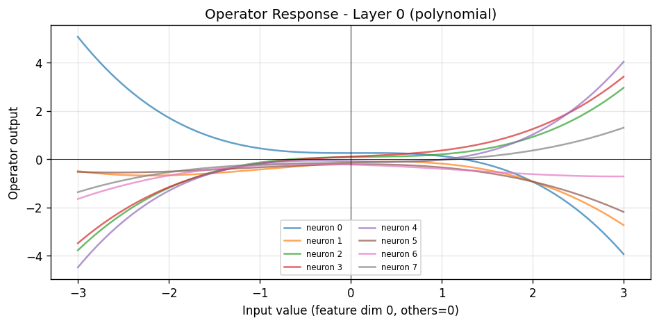 | 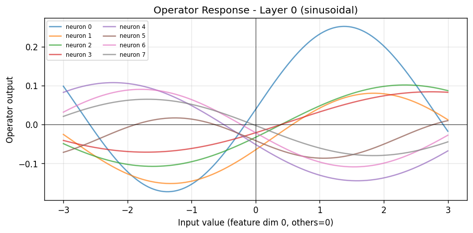 | 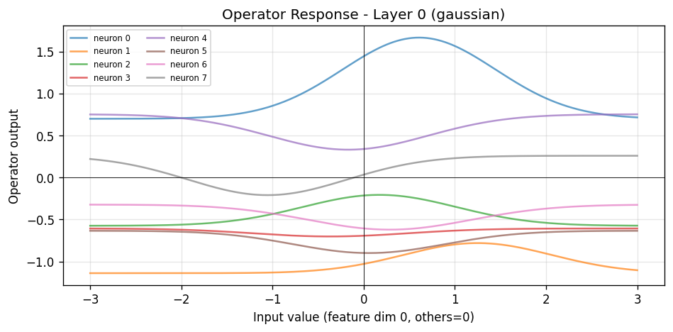 |

Each plot above shows the final learned input-output response curve of the first operator layer after training. The x-axis is the input value swept across the data range; the y-axis is the output of one representative output neuron. These three images make the core ONN insight viscerally clear: the polynomial operator has converged to a smooth cubic-like curve; the sinusoidal operator to a damped oscillation tuned to the moons' periodic boundary; the Gaussian operator to a sharp bump centered near the transition region between the two concentric circles. A standard MLP neuron's response would just be a straight line through the origin (ReLU) or an S-curve (sigmoid) - fixed shapes that cannot adapt to the data's structure. The ONN's operators adapt.

Consider the spiral dataset classification task. To achieve roughly 93% accuracy, a well-tuned MLP typically needs at least 3 hidden layers of 32 neurons each:

```
MLP (3 hidden layers of 32):
  Layer 1:  2 * 32 + 32  =    96 params
  Layer 2: 32 * 32 + 32  = 1,056 params
  Layer 3: 32 * 32 + 32  = 1,056 params
  Output:  32 *  2 +  2  =    66 params
  Total:                    2,274 params  --  ~90-92% accuracy
```

An ONN with only 2 hidden layers using a polynomial operator (degree=3) achieves comparable or better accuracy with one fewer layer:

```
ONN (2 hidden layers of 32, polynomial degree=3):
  Layer 1 operator:  2 * 32 * 4 + 32  =   288 params  (polynomial coefficients)
  Layer 1 BN:        32 * 2           =    64 params  (scale + shift)
  Layer 2 operator: 32 * 32 * 4 + 32  = 4,128 params
  Layer 2 BN:        32 * 2           =    64 params
  Output:            32 *  2 +  2     =    66 params
  Total:                                 4,610 params  --  ~93-96% accuracy
```

The ONN uses more total parameters because polynomial coefficients add a `degree+1` multiplier per operator. However, the extra parameters are **qualitatively different** - they encode the curvature of the learned function, not just more linear combinations. You can inspect this curvature directly from `operator_response.png`. With a standard MLP you can only measure weights numerically; with an ONN you can visualize the actual shape of what each neuron has learned to compute.

For maximum parameter efficiency, the `sinusoidal` and `gaussian` operators (224 params per layer vs 288 for polynomial) achieve similar accuracy on their best-suited datasets with fewer parameters than an equivalent MLP layer.

### Performance Comparison

| # | Model | Dataset | Epochs | Typical Accuracy | Parameter Count |
|---|---|---|---|---|---|
| <sub>1</sub> | <sub>ONN (polynomial)</sub> | <sub>spiral</sub> | <sub>80</sub> | <sub>~93-96%</sub> | <sub>~3,000</sub> |
| <sub>2</sub> | <sub>ONN (sinusoidal)</sub> | <sub>moons</sub> | <sub>60</sub> | <sub>~96-98%</sub> | <sub>~2,500</sub> |
| <sub>3</sub> | <sub>ONN (gaussian)</sub> | <sub>circles</sub> | <sub>60</sub> | <sub>~96-98%</sub> | <sub>~2,500</sub> |
| <sub>4</sub> | <sub>BaselineMLP</sub> | <sub>spiral</sub> | <sub>80</sub> | <sub>~88-92%</sub> | <sub>~2,200</sub> |
| <sub>5</sub> | <sub>BaselineMLP</sub> | <sub>moons</sub> | <sub>60</sub> | <sub>~94-96%</sub> | <sub>~2,200</sub> |

> **Comparison bar chart - ONN vs MLP test accuracy and F1 across datasets**
> *(Generated after running both operators; combine multiple results for a full comparison)*

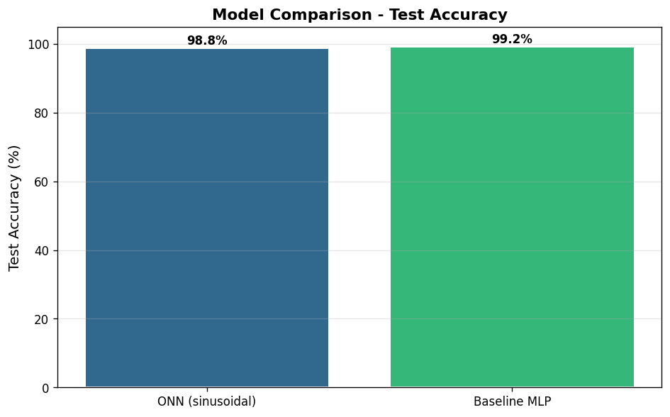

### How to Read These Numbers

The accuracy ranges in the table above are intentional - they reflect real run-to-run variability across random seeds, noise levels, and training dynamics. A difference of less than 2% between ONN and MLP should not be treated as significant; it sits within the noise floor of stochastic gradient descent on a 240-sample test set.

What matters more than the scalar accuracy is **consistency across seeds**. Run the same experiment with seeds 42, 123, 456, and 789 before drawing any conclusions about which model is better on a given dataset:

```bash
for seed in 42 123 456 789; do
  python -m src.main --dataset spiral --operator polynomial --seed $seed \
    2>&1 | grep "FINAL RESULTS" -A 3 >> outputs/seed_comparison.txt
done
```

On the spiral dataset specifically, the ONN tends to produce a **smoother, cleaner decision boundary** (visible in `decision_boundaries.png`) even when final accuracy is numerically similar. This is because the polynomial operator naturally produces smooth curved surfaces, while the MLP's piecewise-linear segments create jagged approximations of the spiral arms. Accuracy alone cannot capture this qualitative difference.

> Accuracy figures are approximate and depend on random seed, noise level, and architecture choices. Run the demo yourself for exact numbers on your machine.

> [!IMPORTANT]
> The goal of this demo is not to claim ONNs always outperform MLPs - they do not on all tasks. The goal is to make the **mechanism of operator learning visible** through the trajectory and response plots, so you can build intuition for when and why ONNs help.

---

## API Reference

<details>
<summary><strong>src/model/operators.py - Operator Classes</strong></summary>

### `PolynomialOperator(in_features, out_features, degree=3)`

Applies a learnable polynomial transformation of degree `degree` to each input, then sums weighted contributions across all inputs for each output neuron. The coefficient tensor `coeffs` has shape `(out_features, in_features, degree+1)` - one coefficient per degree term per input-output pair. Inputs are clamped to `[-10, 10]` before exponentiation to prevent numerical overflow.

**Parameters:**
- `in_features` (int) - Input dimensionality
- `out_features` (int) - Output dimensionality
- `degree` (int, default=3) - Maximum polynomial degree

**Learnable attributes:** `coeffs`, `bias`

---

### `SinusoidalOperator(in_features, out_features)`

Computes a weighted sum of sinusoidal responses where the frequency and phase for each input-output pair are themselves learned parameters. This operator is particularly effective when the target function has periodic or oscillatory structure. Frequencies are initialized near 1.0 with small random noise.

**Parameters:**
- `in_features` (int) - Input dimensionality
- `out_features` (int) - Output dimensionality

**Learnable attributes:** `weight`, `freq`, `phase`, `bias`

---

### `GaussianOperator(in_features, out_features)`

Computes a weighted sum of Gaussian (RBF) responses. Each Gaussian has a learnable center `mu` and width `sigma`. The width parameter is stored as `log_sigma` and passed through `softplus` to ensure positivity. This operator naturally learns to activate strongly near specific input regions, making it well-suited for datasets with localized cluster structures.

**Parameters:**
- `in_features` (int) - Input dimensionality
- `out_features` (int) - Output dimensionality

**Learnable attributes:** `weight`, `mu`, `log_sigma`, `bias`

---

### `MultiplicativeOperator(in_features, out_features, rank=4)`

Combines a standard linear term with a rank-`r` factored interaction term that captures pairwise multiplicative relationships between inputs. The interaction is computed as `(U @ x) * (V @ x)` summed over `rank` factors, efficiently approximating the full quadratic interaction matrix without the `O(in^2)` parameter cost.

**Parameters:**
- `in_features` (int) - Input dimensionality
- `out_features` (int) - Output dimensionality
- `rank` (int, default=4) - Factorization rank for interaction term

**Learnable attributes:** `linear.weight`, `linear.bias`, `U`, `V`

</details>

<details>
<summary><strong>src/model/onn_layer.py - ONNLayer</strong></summary>

### `ONNLayer(in_features, out_features, operator='polynomial', activation=None, use_bn=True, dropout=0.0, operator_kwargs=None)`

The core building block of every `ONNModel`. It wraps a chosen operator with optional batch normalization and dropout to form a complete layer. The forward pass runs: `operator -> BatchNorm1d -> activation -> Dropout`. If `use_bn=True` (default), `BatchNorm1d` is applied to the raw operator output before activation, which significantly stabilizes training.

**Key method: `get_operator_params() -> dict`**

Returns a snapshot of all learnable operator parameters as detached cloned tensors. Used by `ONNModel.get_param_snapshots()` to record parameter evolution during training for the trajectory plots.

</details>

<details>
<summary><strong>src/model/onn_model.py - ONNModel</strong></summary>

### `ONNModel(in_features, hidden_sizes, n_classes, operator, dropout, operator_kwargs)`

A full feedforward classification network built entirely from `ONNLayer` blocks with a final `nn.Linear` output head. The number of hidden layers is determined by `len(hidden_sizes)`. The model includes a `get_param_snapshots()` method that iterates all `ONNLayer` instances and records their operator parameter states - this is what powers the `operator_trajectories.png` visualization.

</details>

<details>
<summary><strong>src/train.py - Training Loop</strong></summary>

### `train_model(model, train_loader, test_loader, epochs, lr, device, save_checkpoints, output_dir)`

The main training loop. Uses `AdamW` optimizer with `CosineAnnealingLR` schedule. Gradient clipping at `max_norm=1.0` is applied on every backward pass. At each epoch, train and test loss and accuracy are recorded. If `save_checkpoints=True`, the model state dict is saved after the final epoch. Returns a history dict with keys `train_loss`, `test_loss`, `train_acc`, `test_acc`.

</details>

<details>
<summary><strong>src/data.py - Dataset Generation</strong></summary>

### `load_dataset(name, n_samples, noise, batch_size, random_state)`

Generates one of three 2D binary classification datasets using scikit-learn generators (`make_moons`, `make_circles`) or a custom spiral generator. Features are standardized using `StandardScaler` fit on the training split only (no data leakage). Returns `(train_loader, test_loader, in_features, n_classes)`.

### `get_full_tensors(name, n_samples, noise, random_state)`

Returns the full train/test sets as raw PyTorch tensors (not wrapped in DataLoader). Used by the visualization module to generate decision boundary grids.

</details>

<details>
<summary><strong>src/evaluate.py - Evaluation</strong></summary>

### `compare_models(onn, mlp, X_test, y_test, device)`

Runs both models on the test set and returns a comparison dict with accuracy, F1 (macro), and parameter counts for each. Also prints a formatted comparison table to stdout.

### `predict_grid(model, x_range, y_range, resolution, device)`

Generates a dense grid of points covering the input space and runs model inference on each point. Returns the predicted class labels as a 2D array, which is used by matplotlib to draw the color-filled decision boundary plots.

</details>

<details>
<summary><strong>src/visualize.py - Visualization</strong></summary>

### `plot_decision_boundaries(onn, mlp, X_train, X_test, y_train, y_test, device, save_path)`

Creates a side-by-side figure showing the color-filled decision boundary for the ONN (left) and MLP (right), with training and test data points overlaid. Color fills represent predicted class probability regions.

### `plot_training_curves(history_onn, history_mlp, save_path)`

Plots four subplots: train loss, test loss, train accuracy, and test accuracy for both models on the same axes. Useful for comparing convergence behavior.

### `plot_operator_trajectories(snapshots, save_path)`

Takes the list of parameter snapshots recorded during training and plots the L2 norm of each parameter group (e.g., `coeffs`, `bias`) over epochs. Shows whether and when operator parameters are actively changing during learning.

### `plot_operator_response(onn, input_range, save_path)`

Sweeps a 1D input across `input_range`, feeds it through the first operator in the network, and plots the learned response curve. This directly visualizes what nonlinear function the operator has converged to.

### `plot_comparison_bar(results, save_path)`

Draws a grouped bar chart comparing ONN and MLP test accuracy and F1 score side by side.

</details>

---

## Reproducibility

This project is fully reproducible. The `set_seed()` utility in `src/utils.py` sets seeds for Python's `random` module, `numpy`, and `torch` (including CUDA seeds). Passing `--seed 42` (the default) guarantees identical results across runs on the same hardware and PyTorch version.

> [!TIP]
> To systematically compare operators, run the same dataset with different operators and fixed seed, then compare the `results_summary.txt` files:
> ```bash
> for op in polynomial sinusoidal gaussian multiplicative; do
>   python -m src.main --dataset spiral --operator $op --seed 42 > outputs/log_$op.txt
> done
> ```

---

## Testing

The test suite covers all three layers of the stack - operators, models, and data loading. Tests are written with `pytest` and use parameterization to cover multiple input shapes and operator types efficiently.

### Test Coverage Summary

| # | Test File | What Is Tested | Test Count |
|---|---|---|---|
| <sub>1</sub> | <sub>tests/test_operators.py</sub> | <sub>Output shape, forward pass no-crash, gradient flow, numerical stability</sub> | <sub>All 4 operators x multiple shapes</sub> |
| <sub>2</sub> | <sub>tests/test_models.py</sub> | <sub>ONNModel and BaselineMLP forward pass, parameter count, snapshot correctness</sub> | <sub>Forward shape + snapshot tests</sub> |
| <sub>3</sub> | <sub>tests/test_data.py</sub> | <sub>Dataset loading, split sizes, feature normalization, tensor dtypes</sub> | <sub>All 3 datasets</sub> |

```bash
# Run all tests
pytest tests/ -v

# Run with short traceback on failure
pytest tests/ -v --tb=short
```

> [!NOTE]
> Tests run on CPU by default and complete in under 10 seconds on any modern laptop. There are no external network calls or file I/O in the test suite - everything is generated in-memory.

**What each test file actually verifies:**

- `test_operators.py` - For each of the 4 operators it checks: (a) that the output tensor has exactly the right shape `(batch, out_features)`, (b) that a forward pass with random inputs does not crash or produce NaN, (c) that gradients flow back through the operator (`.grad` is not None after `.backward()`), and (d) that the operator handles edge cases like `batch_size=1` correctly.

- `test_models.py` - Verifies that `ONNModel` and `BaselineMLP` accept the same input shape and produce logits of the right shape. Also checks that `get_param_snapshots()` returns a non-empty list with the correct number of snapshots after a training call, and that parameter counts match the expected formula for the given `hidden_sizes` and operator.

- `test_data.py` - Checks that all three dataset generators (`moons`, `circles`, `spiral`) return the correct split sizes (80% train, 20% test), that features are properly normalized (roughly zero mean and unit standard deviation), and that the returned tensors have `dtype=torch.float32` and `dtype=torch.long` for features and labels respectively.

---

## ONN vs Transformer Attention: Operators vs Routing

### Background: "Attention Is All You Need" (Vaswani et al., 2017)

The Transformer architecture, introduced in the landmark 2017 paper "Attention Is All You Need," revolutionized sequence modeling and has since spread to vision, audio, protein structure prediction, and almost every domain in deep learning. Before Transformers, recurrent networks (LSTMs, GRUs) processed sequences one timestep at a time - which was inherently sequential, slow to train on modern GPU hardware, and struggled to carry information across long spans within a sequence. The Transformer's breakthrough was **self-attention**: a mechanism where every position in a sequence can directly and simultaneously attend to every other position, with the strength of each connection computed dynamically from the content of the input itself.

Understanding how Transformers work at a mechanistic level is essential context for understanding where ONNs fit in the deep learning landscape - because both papers respond to the same root problem (standard linear transforms are not expressive enough) but from completely different angles and for completely different use cases.

### How Transformer Self-Attention Works

In a Transformer, the input is a sequence of token embeddings: a matrix `X` of shape `(seq_len, d_model)`. The self-attention mechanism transforms this into a new representation of the same shape by computing pairwise relationships between every token:

```python
# Step 1: Project inputs into Query, Key, Value spaces
Q = X @ W_Q    # shape: (seq_len, d_k) - "what am I looking for?"
K = X @ W_K    # shape: (seq_len, d_k) - "what do I contain?"
V = X @ W_V    # shape: (seq_len, d_v) - "what information can I offer?"

# Step 2: Compute attention scores - how much should token i attend to token j?
scores = Q @ K.T / sqrt(d_k)          # shape: (seq_len, seq_len)
weights = softmax(scores, dim=-1)     # normalize rows to probability distributions

# Step 3: Weighted aggregation - each output is a blend of ALL value vectors
output = weights @ V    # shape: (seq_len, d_v)

# Step 4: Project back and add residual connection
attended = output @ W_O + X
```

The critical property here is that `weights` is **computed from the input X itself**. Every time you feed a different sentence through the model, the attention weights change. The word "bank" in "river bank" will attend differently than "bank" in "bank account" - the same trained model parameters produce different routing behavior for different inputs. This is called **dynamic, content-based routing** and it is the core innovation of the Transformer.

After the self-attention sublayer, each Transformer block also applies a **Feed-Forward Network (FFN)** sublayer - a standard 2-layer MLP applied independently and identically to each token position:

```python
# Transformer FFN sublayer (applied per token position, identical for all positions)
ffn_out = dropout( GELU( x @ W1 + b1 ) @ W2 + b2 )
```

This FFN is where the per-position "thinking" happens. Attention mixes information across the sequence; the FFN processes each position's result with a nonlinear transformation. The FFN accounts for roughly two-thirds of total parameters in a standard Transformer - and it is exactly the part that ONN operators could improve.

### How an ONN Layer Works - Side by Side

An ONN layer operates on a single fixed-size feature vector with no concept of sequence, ordering, or cross-sample relationships. Here is a direct comparison using the polynomial operator on the spiral dataset:

```python
# ONN PolynomialOperator forward pass
# Input: x of shape (batch, 2) - one (x1, x2) coordinate pair per sample

# Step 1: Build polynomial basis for each feature
basis = stack([x**0, x**1, x**2, x**3], dim=2)   # shape: (batch, 2, 4)
# Each column is x raised to a different power: [1, x, x^2, x^3]

# Step 2: Apply learned coefficient tensor
out = einsum('bid,oid->bo', basis, coeffs) + bias   # shape: (batch, 32)
# coeffs shape: (32, 2, 4) - one coefficient per output neuron per input per degree
# The SHAPE of the polynomial surface is encoded in coeffs and changes every gradient step

# Step 3: Normalize and activate
out = BatchNorm1d(out)     # stabilize scale
out = ReLU(out)            # introduce positive nonlinearity
out = Dropout(out, 0.1)   # regularize
```

There is no sequence. There is no cross-sample computation. Each of the 64 samples in a mini-batch is processed completely independently. The expressiveness comes entirely from the shape of the polynomial surface encoded in `coeffs` - not from any dynamic routing or attention-style weighting.

### Architecture Comparison Diagram

```mermaid
graph TB
    subgraph TA ["Transformer Block  - Vaswani et al. 2017"]
        T1["Token Sequence\n(seq_len x d_model)"] --> T2["Multi-Head Self-Attention\nQ K V projections + softmax"]
        T2 --> T3["Add + LayerNorm"]
        T3 --> T4["Feed-Forward Network\n2-layer MLP per token position"]
        T4 --> T5["Add + LayerNorm"]
        T5 --> T6["Output Sequence\n(seq_len x d_model)"]
    end

    subgraph OA ["ONN Block  - Kiranyaz et al. 2021"]
        O1["Feature Vector\n(batch x in_features)"] --> O2["Operator Neuron\nphi of x with theta"]
        O2 --> O3["BatchNorm1d"]
        O3 --> O4["Activation + Dropout"]
        O4 --> O5["Output Features\n(batch x out_features)"]
    end
```

### Key Property Comparison

| # | Property | Transformer Self-Attention | ONN Operator Layer |
|---|---|---|---|
| <sub>1</sub> | <sub>Input type</sub> | <sub>Sequence of tokens (variable length)</sub> | <sub>Fixed-size feature vector (no sequence)</sub> |
| <sub>2</sub> | <sub>Core innovation</sub> | <sub>Dynamic cross-token information routing</sub> | <sub>Per-neuron learnable nonlinear transformation</sub> |
| <sub>3</sub> | <sub>Weights depend on input?</sub> | <sub>Yes - attention scores recomputed every forward pass</sub> | <sub>No - operator parameters are static after training</sub> |
| <sub>4</sub> | <sub>Computational complexity</sub> | <sub>O(n^2 * d) where n = sequence length</sub> | <sub>O(batch * in * out) - same scale as nn.Linear</sub> |
| <sub>5</sub> | <sub>Cross-sample interaction</sub> | <sub>Yes - tokens attend to all other tokens</sub> | <sub>No - each sample processed independently</sub> |

| # | Property | Transformer Self-Attention | ONN Operator Layer |
|---|---|---|---|
| <sub>6</sub> | <sub>Source of expressiveness</sub> | <sub>Flexible information routing across positions</sub> | <sub>Rich parameterized function per neuron</sub> |
| <sub>7</sub> | <sub>Positional information</sub> | <sub>Required (positional encoding injected)</sub> | <sub>Not applicable - no ordered sequence</sub> |
| <sub>8</sub> | <sub>Best suited for</sub> | <sub>NLP, vision sequences, any structured ordered data</sub> | <sub>Tabular data, fixed feature vectors, 2D signals</sub> |
| <sub>9</sub> | <sub>Interpretability</sub> | <sub>Attention maps show which tokens relate</sub> | <sub>Operator response curve shows learned function shape</sub> |
| <sub>10</sub> | <sub>Parameter scaling</sub> | <sub>Scales with d_model^2 for Q, K, V, O projections</sub> | <sub>Scales with in * out * operator_degree</sub> |

### Concrete Example: What Each Architecture Sees on the Spiral Dataset

The spiral dataset in this project consists of 1200 independent 2D points `(x1, x2)`, each labeled 0 or 1 based on which arm of the spiral it belongs to. There is no ordering, no sequence, and no relationship between different points - each point must be classified entirely on its own merits.

**Using a Transformer on this dataset would mean:**

Treating the 2 feature dimensions `(x1, x2)` as a "sequence" of length 2. The attention mechanism would compute a 2x2 matrix of scores asking: "how much should x1 attend to x2, and vice versa?" The answer is roughly "equally" for almost every point on the spiral - x1 and x2 are always both relevant. So the attention weights would converge to approximately `[[0.5, 0.5], [0.5, 0.5]]` and stop changing meaningfully. The FFN sublayer would then do all the real work - which is exactly what an MLP does anyway. You would be paying the overhead of computing Q, K, V projections and a softmax for zero benefit, while the model still struggles to learn the spiral's curved boundary with piecewise-linear FFN neurons.

**Using an ONN on this dataset:**

Each point `(x1, x2)` is fed directly through a polynomial operator that computes a curved surface over the 2D input space. The polynomial coefficients are free to learn any degree-3 polynomial in `(x1, x2)` space - which is rich enough to capture the spiral's curvature in a single layer. No attention mechanism is needed because there is no sequence structure to route information through. The ONN solves the right problem with the right tool.

> [!IMPORTANT]
> Transformer self-attention is specifically designed for data that has **relational structure across positions** - where the meaning of element i depends on which other elements surround it. For independent fixed-size feature vectors (sensor readings, tabular rows, or the 2D toy datasets in this project), attention adds complexity without benefit. ONNs are the appropriate tool when the challenge is modeling a complex function of each sample's features, not routing information between samples.

### What Each Architecture Is Actually Learning

Both architectures train with gradient descent, but the gradients update fundamentally different things:

| # | What Is Being Learned | Transformer | ONN |
|---|---|---|---|
| <sub>1</sub> | <sub>Routing policy</sub> | <sub>W_Q, W_K determine which tokens attend to which</sub> | <sub>Not applicable - no routing</sub> |
| <sub>2</sub> | <sub>Value aggregation</sub> | <sub>W_V, W_O project and blend value vectors</sub> | <sub>Not applicable</sub> |
| <sub>3</sub> | <sub>Per-position transform</sub> | <sub>FFN weights (linear + GELU, fixed shape)</sub> | <sub>Operator params (curve shape itself is learned)</sub> |
| <sub>4</sub> | <sub>Function shape</sub> | <sub>Indirectly, by composing multiple fixed-shape FFN layers</sub> | <sub>Directly - each neuron's curve is a trainable parameter</sub> |
| <sub>5</sub> | <sub>Normalization</sub> | <sub>LayerNorm after each sublayer</sub> | <sub>BatchNorm1d after each operator</sub> |

> **Gaussian ONN vs MLP on circles - a case where localized operators shine**
> *(Generated by `python -m src.main --dataset circles --operator gaussian --epochs 60`)*

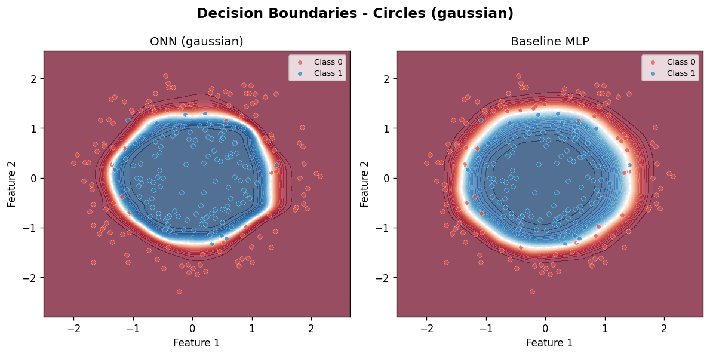

This plot is one of the clearest illustrations of the architectural difference. The circles dataset has a hard outer ring of class 1 surrounding an inner disk of class 0. The MLP (right panel) approximates the circular boundary with polygon-like edges - the more neurons you add, the more sides the polygon gets, but it never becomes truly circular. The Gaussian ONN (left panel) learns smooth curved boundaries because each Gaussian neuron activates strongly in a localized circular region around its center parameter `mu`. After training, the `mu` values drift outward to straddle the ring boundary, and the `sigma` parameters (controlling Gaussian width) shrink to produce a sharp transition - exactly what the geometry of this dataset requires. No architectural inductive bias was hardcoded; the operator shape discovered this structure from the data alone.

> **Operator parameter trajectories - L2 norm of each parameter group over training**
> *(Gaussian operator on circles, 60 epochs)*

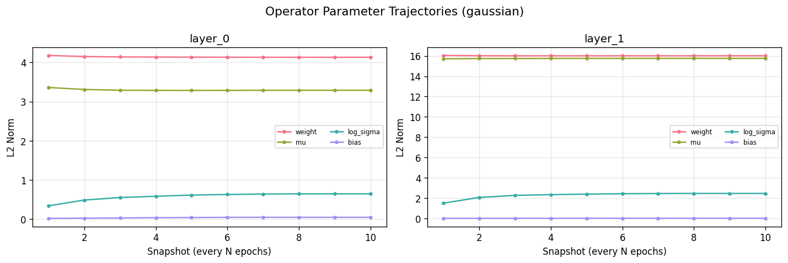

The trajectory plot above shows the L2 norm of `weight`, `mu`, and `log_sigma` parameter groups tracked at every epoch during training. The most informative signal is whether a parameter group's norm is **moving** or **flat**. A flat `mu` trajectory early in training means the Gaussian centers are not yet relocating - usually because the learning rate is too low or the preceding BatchNorm layer is not yet calibrated. Once `mu` norms start changing rapidly (typically epochs 5-15 on the circles dataset), you can watch in `decision_boundaries.png` that the circular boundary sharpens at the same time. If `log_sigma` decreases monotonically to a very small value, the Gaussians are becoming too narrow - consider adding weight decay to prevent this.

### Can ONN Operators Replace the Transformer FFN?

Yes - this is a natural extension that follows directly from both architectures' designs. The Transformer FFN sublayer is a standard 2-layer MLP applied identically to each token position. Replacing it with an ONN layer would give each token a richer per-position transformation while leaving the self-attention mechanism completely unchanged:

```python
# Standard Transformer FFN sublayer
class TransformerFFN(nn.Module):
    def __init__(self, d_model, d_ff):
        super().__init__()
        self.fc1 = nn.Linear(d_model, d_ff)
        self.fc2 = nn.Linear(d_ff, d_model)

    def forward(self, x):
        # Linear transform -> GELU -> linear transform
        # The shape of this transformation is fixed (GELU does not change)
        return self.fc2(F.gelu(self.fc1(x)))


# ONN-augmented Transformer FFN sublayer
class ONNTransformerFFN(nn.Module):
    def __init__(self, d_model, d_ff, operator='polynomial'):
        super().__init__()
        self.onn_up   = ONNLayer(d_model, d_ff,    operator=operator)
        self.onn_down = ONNLayer(d_ff,    d_model, operator=operator)

    def forward(self, x):
        # Operator transform -> BatchNorm -> ReLU -> operator transform
        # The SHAPE of the transformation is itself being learned
        return self.onn_down(self.onn_up(x))
```

This hybrid would combine the Transformer's strength (flexible cross-token information routing via attention) with ONN's strength (richer per-token transformation via parameterized operators). The key open question is whether richer per-position operators help on language or vision tasks at scale - this has not been thoroughly evaluated and is an active research direction. Several related approaches exist (Mixture of Experts FFN, gated linear units, low-rank FFN variants) that share the same design motivation: the FFN is expensive and its fixed-shape nonlinearity may be a bottleneck.

> [!NOTE]
> The attention mechanism in a Transformer is itself a form of input-dependent linear combination - softmax weights applied to Value vectors. It is not "nonlinear per neuron" in the ONN sense. Adding ONN operators to the FFN sublayer would make the position-wise transformations richer, which is complementary to attention rather than a replacement for it.

### Three Different Solutions to the Same Root Problem

The history of deep learning can be understood as a series of attempts to increase expressiveness without simply scaling up model size:

1. **Deeper MLPs (1980s-2010s)** - Stack more layers. More layers means more composed piecewise-linear segments, which eventually approximate smooth nonlinear functions. The cost is vanishing gradients, slow training, and the need for careful initialization. ResNets, skip connections, and batch normalization are all engineering solutions to problems caused by excessive depth.

2. **Transformer Attention (2017)** - Add dynamic routing across sequence positions. Flexible information flow means better handling of long-range dependencies in language and vision. The cost is O(n^2) attention computation (addressed by FlashAttention, sparse attention, etc.) and the requirement that data has sequential or relational structure.

3. **ONN Operators (2021)** - Make each individual neuron richer. Instead of a weighted sum, each neuron computes a parameterized nonlinear function whose shape is discovered from data. The cost is slightly more complex optimization (operator parameters interact with each other) and careful initialization to avoid numerical instability.

All three approaches are complementary. A hypothetical future architecture might use all three: deep Transformer blocks (depth) with self-attention sublayers (cross-token routing), where the FFN sublayers use ONN-style operators (richer per-neuron computation per position).

---

## FFN vs ONN: Detailed Differences and What Comes Next

### Exactly What a Transformer FFN Sublayer Computes

The Transformer FFN sublayer is deceptively simple. For each token position independently, it applies a two-layer MLP:

```
step 1:  h = GELU( x @ W1 + b1 )       W1 shape: (d_model, d_ff)
step 2:  y = h @ W2 + b2               W2 shape: (d_ff, d_model)
```

`d_ff` is typically set to `4 * d_model` (e.g., 3072 for a 768-dimensional model). This is where roughly two-thirds of a Transformer's total parameters live. The GELU activation is a smooth approximation of ReLU - it is not learned; its shape is always the same fixed sigmoid-weighted curve. Every single token in every single layer uses the exact same FFN weights `W1`, `W2`. The FFN has no concept of which token it is processing - the only thing that differentiates one token's FFN output from another is the input `x` value itself, which was already shaped by the preceding attention sublayer.

The key design choice that makes this work is **the residual connection**: the FFN output is added back to its input (`y + x`) before being passed to the next layer. This means the FFN only needs to compute a "correction" to the attention output, not the full representation from scratch. Without the residual connection, deep Transformers cannot be trained reliably.

### Exactly What an ONN Operator Layer Computes

An ONN operator layer replaces `W @ x + b` (the linear projection inside each FFN step) with a parameterized nonlinear function whose shape is not fixed at design time but is learned during training:

```
# FFN step: fixed shape (GELU curve never changes)
h_ffn = GELU( x @ W1 + b1 )

# ONN polynomial step: adaptive shape (coefficients change every gradient step)
h_onn = sum_d ( x^d * coeffs_d )    # coeffs_d changes shape of curve

# ONN sinusoidal step: frequency and phase adapt
h_onn = weight * sin( freq * x + phase )    # freq + phase shift over training

# ONN Gaussian step: center and width adapt
h_onn = weight * exp( -sigma * (x - mu)^2 )    # mu + sigma change
```

The critical difference is that `W1` and `W2` in the FFN have a fixed mathematical structure - they always compute a dot product. `coeffs`, `freq`, `phase`, `mu`, `sigma` in ONN operators each carry a different kind of inductive bias about the **shape** of the function being approximated. When the dataset has a periodic structure, `freq` and `phase` adapt to capture it. When the dataset has localized clusters, `mu` and `sigma` adapt to straddle them. The FFN has no analogous mechanism - it cannot change its functional form, only its weights.

### Side-by-Side Difference Summary

| # | Aspect | Transformer FFN Sublayer | ONN Operator Layer | Implication |
|---|---|---|---|---|
| <sub>1</sub> | <sub>Activation shape</sub> | <sub>Fixed (GELU/ReLU, never changes)</sub> | <sub>Learned (polynomial degree, sinusoidal freq, Gaussian mu/sigma)</sub> | <sub>ONN adapts to data structure; FFN always uses same curve</sub> |
| <sub>2</sub> | <sub>Number of linear projections</sub> | <sub>2 (up-projection + down-projection)</sub> | <sub>1 operator transform (equivalent depth)</sub> | <sub>ONN achieves more per layer with same or fewer ops</sub> |
| <sub>3</sub> | <sub>Normalization</sub> | <sub>LayerNorm (normalizes across features per token)</sub> | <sub>BatchNorm1d (normalizes across batch per feature)</sub> | <sub>Different statistical assumptions; LayerNorm more stable at small batch sizes</sub> |
| <sub>4</sub> | <sub>Residual connection</sub> | <sub>Always present (required for training stability)</sub> | <sub>Not in current implementation (can be added)</sub> | <sub>Adding residual to ONN layers would enable much greater depth</sub> |
| <sub>5</sub> | <sub>Interpretability</sub> | <sub>Weight matrices hard to interpret directly</sub> | <sub>Operator response curve directly visualizable</sub> | <sub>ONN debugging is more intuitive via operator_response.png</sub> |

| # | Aspect | Transformer FFN Sublayer | ONN Operator Layer | Implication |
|---|---|---|---|---|
| <sub>6</sub> | <sub>Parameter count scaling</sub> | <sub>2 * d_model * d_ff (large, dominates model size)</sub> | <sub>in * out * (degree+1 or 3) - similar scale</sub> | <sub>Comparable parameter budgets; ONN may do more per param</sub> |
| <sub>7</sub> | <sub>Data type best suited for</sub> | <sub>Token representations after attention (dense, high-d)</sub> | <sub>Fixed feature vectors (low-to-mid dimensional)</sub> | <sub>ONN most effective when input dimensionality is 2-512</sub> |
| <sub>8</sub> | <sub>Training stability</sub> | <sub>Well-studied, many tuning recipes available</sub> | <sub>More sensitive to LR and input normalization</sub> | <sub>Always normalize inputs before ONN layers</sub> |
| <sub>9</sub> | <sub>Gradient flow</sub> | <sub>Residual connections ensure strong gradient signal</sub> | <sub>BatchNorm stabilizes but no residual by default</sub> | <sub>Deeper ONN stacks may need skip connections</sub> |
| <sub>10</sub> | <sub>Inductive bias</sub> | <sub>None beyond smoothness of GELU</sub> | <sub>Explicit (polynomial = smooth curves; Gaussian = locality; sinusoidal = periodicity)</sub> | <sub>ONN works better when you have domain knowledge about data structure</sub> |

### Next Steps: A Roadmap for Extending This Project

This demo implements the core ONN concepts cleanly and experimentally verifiably. Below is a concrete roadmap of extensions ordered from easiest to most research-novel. Each step builds on the previous one and has a clear definition of done.

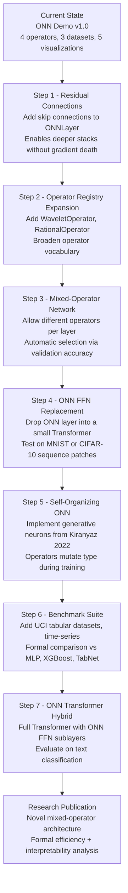

#### Step 1 - Add Residual Connections to ONNLayer (1-2 hours)

The single highest-impact change you can make right now. Add a skip connection from the layer input to the layer output, matching dimensions with a 1x1 linear projection when `in_features != out_features`. This is the same trick ResNets use and it directly enables training deeper ONN stacks without vanishing gradients.

```python
# Current ONNLayer forward:
def forward(self, x):
    x = self.operator(x)
    x = self.bn(x)
    x = self.activation(x)
    x = self.drop(x)
    return x

# With residual connection:
def forward(self, x):
    residual = self.proj(x)   # 1x1 linear, only if dims differ
    out = self.operator(x)
    out = self.bn(out)
    out = self.activation(out + residual)   # add before activation
    out = self.drop(out)
    return out
```

This single change would allow experiments with 6-8 ONN layers instead of the current 2-3, making the architecture directly comparable to deeper MLPs used in tabular benchmarks.

#### Step 2 - Expand the Operator Registry (2-4 hours)

Add two new operators to `src/model/operators.py` and register them in `OPERATOR_REGISTRY`:

- **`WaveletOperator`** - Learnable Morlet wavelet: `w * cos(freq * x) * exp(-sigma * x^2)`. Combines the locality of Gaussian with the periodicity of Sinusoidal. Well-suited for signal processing tasks and datasets with localized frequency content.

- **`RationalOperator`** - Learnable rational function: `(a0 + a1*x + a2*x^2) / (1 + |b1*x + b2*x^2|)`. Rational functions can approximate a much wider class of functions than polynomials of the same degree, including functions with asymptotes. The absolute value in the denominator prevents division by zero without clamping.

Both can be added by following the exact same pattern as the existing four operators - they are `nn.Module` subclasses with a `forward(self, x)` method.

#### Step 3 - Mixed-Operator Layers (1 day)

Currently the entire network uses a single operator type chosen at the CLI. A natural extension is to allow each layer to use a different operator:

```bash
# Future CLI: specify operator per layer
python -m src.main --operators polynomial sinusoidal gaussian
#   Layer 0 uses polynomial, layer 1 sinusoidal, layer 2 gaussian
```

This opens the question of **operator selection**: which operator should go in which layer? You can answer this empirically with a short grid search over operator permutations, or more elegantly with a validation-accuracy-guided search. The key insight is that earlier layers often benefit from global operators (polynomial) while later layers benefit from localized ones (Gaussian), mirroring how CNN features progress from global edges to local textures.

#### Step 4 - ONN as Transformer FFN Replacement (1-3 days)

This is the most directly testable research contribution. Take a small Transformer (4 layers, 256-dimensional, 4 attention heads) trained on a sequence classification task. Replace each FFN sublayer with an `ONNLayer` using the polynomial or sinusoidal operator. Keep the attention sublayers identical. Measure:

- Does training loss converge faster?
- Does final test accuracy improve?
- Does `operator_response.png` show interpretable per-token transformation curves?
- Is the parameter count lower for the same accuracy?

The MNIST-as-patches task (treat each 7x4 strip of pixels as a "token" in a sequence of 4) is an excellent starting point because it is small enough to train in minutes and well-understood enough to have reliable baselines.

#### Step 5 - Self-Organizing Operators (1-2 weeks)

The 2022 follow-up paper by Kiranyaz et al. introduces **generative neurons** that can mutate their operator type during training - a neuron that starts as polynomial can become sinusoidal if the gradient signal suggests a periodic function would fit better. Implementing this requires:

1. A fitness function per neuron (validation loss contribution when that neuron is ablated)
2. A mutation schedule (every N epochs, low-fitness neurons sample a new operator type)
3. Re-initialization of operator parameters after mutation with warm-starting from the previous operator's output scale

This is the most research-novel extension in this list and would produce a genuinely new result if evaluated rigorously on standard benchmarks.

#### Step 6 - Formal Benchmark Suite (1-2 weeks)

To make a credible case for ONN operators beyond toy datasets, add the following benchmark datasets to `src/data.py`:

- **UCI Ionosphere** (34 features, binary classification) - a standard small-scale tabular benchmark
- **Wine Quality** (11 features, multiclass) - regression-like structure
- **MAGIC Gamma Telescope** (10 features, binary) - highly nonlinear boundary
- **Synthetic XOR variants** (N-way XOR, which tests multiplicative interactions directly)

For each dataset, compare ONN vs MLP vs XGBoost vs a simple Neural Oblivious Decision Ensemble (NODE). Report mean accuracy and standard deviation across 10 random seeds.

> [!TIP]
> The fastest way to make progress is to tackle Steps 1 and 2 first - they have the highest return on investment for effort spent and will make subsequent steps easier by giving you a more stable, more expressive base architecture to experiment with.

---

## References

- Kiranyaz, S. et al. "Operational Neural Networks." *Neural Computing and Applications* 32 (2021). - The original paper introducing ONN and the operator neuron formalism. Defines the operator neuron, proves universality, and demonstrates performance on 1D signal and 2D classification tasks.
- Kiranyaz, S. et al. "Self-organized Operational Neural Networks with Generative Neurons." *Neural Networks* (2022). - Extension covering self-organization and generative operator discovery. Introduces neuron mutation and operator type evolution during training.
- Vaswani, A. et al. "Attention Is All You Need." *NeurIPS* (2017). - The Transformer paper. Introduces multi-head self-attention, the encoder-decoder architecture, and positional encodings that replaced recurrent models in NLP. Essential context for the ONN vs FFN comparison in this README.
- He, K. et al. "Deep Residual Learning for Image Recognition." *CVPR* (2016). - Introduced residual skip connections. Directly relevant to the Step 1 next step (adding residual connections to ONNLayer) described in the roadmap.
- Goodfellow, I., Bengio, Y., Courville, A. *Deep Learning*. MIT Press (2016). - Background reference for standard MLP theory, universal approximation theorems, and gradient-based optimization.
- Shazeer, N. et al. "GLU Variants Improve Transformer." *arXiv* (2020). - Describes gated linear units as improved FFN activations in Transformers. Conceptually related to ONN's motivation of making per-neuron transformations richer.

---

<div align="center">

Built with PyTorch - Inspired by Kiranyaz et al. (2021)

</div>
