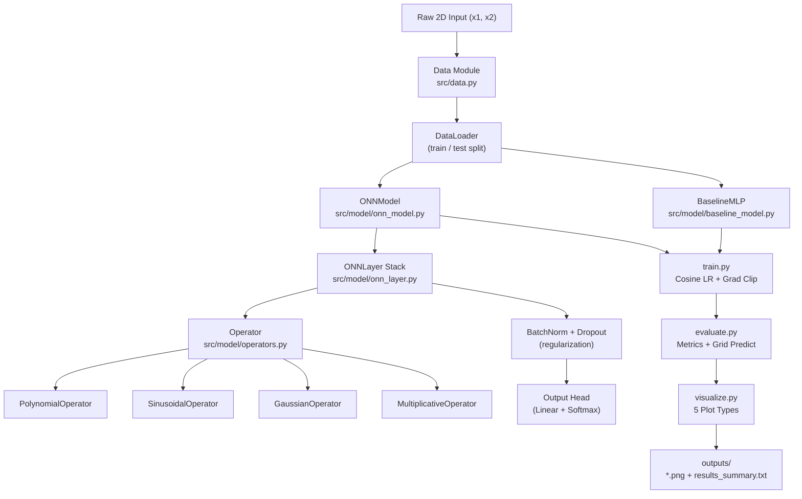
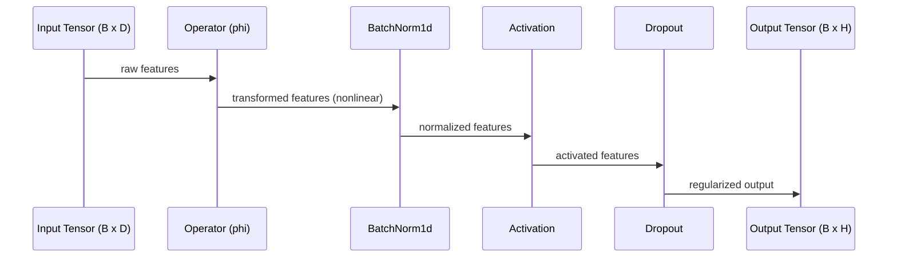
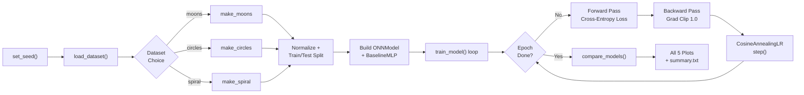
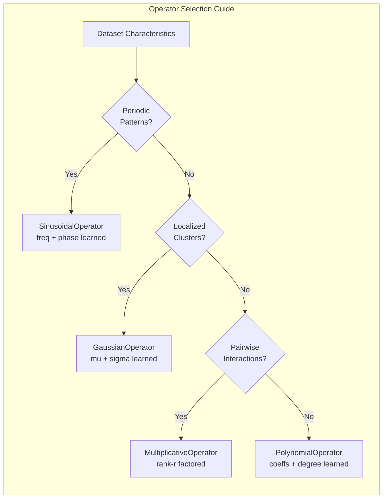
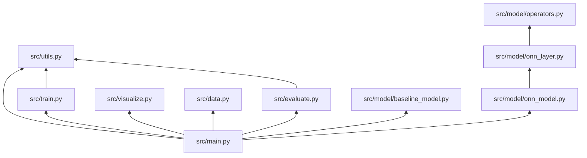

<div align="center">

# Operational Neural Networks (ONN)

[](https://www.python.org/)
[](https://pytorch.org/)
[](LICENSE)
[](https://pytest.org/)
[](https://peps.python.org/pep-0008/)
[](https://jupyter.org/)
[]()

**A complete PyTorch implementation of Operational Neural Networks - a next-generation family of deep learning architectures that replace fixed linear transforms with fully learnable, parameterized operator neurons.**

[Quick Start](#quick-start) - [Architecture](#architecture-deep-dive) - [Operators](#operator-reference) - [CLI Reference](#cli-reference) - [Outputs](#outputs-reference) - [API Docs](#api-reference)

</div>

---

## What is an ONN?

A standard artificial neuron computes a **linear combination** of its inputs followed by a fixed nonlinear activation function. This design, introduced in the 1980s, has powered deep learning for decades - but it forces the network to approximate complex nonlinear functions by stacking many layers. Each individual neuron is fundamentally limited to a weighted sum, meaning the network's expressive power comes entirely from depth and activation choices, not from the neurons themselves.

**Operational Neural Networks (ONNs)** fundamentally change this contract. Instead of a fixed linear transform, each neuron in an ONN uses a **learnable operator** - a parameterized nonlinear function whose shape is updated by gradient descent during training. The result is a neuron that can model polynomial curves, sinusoidal patterns, Gaussian bumps, or multiplicative interactions directly, without needing extra layers to approximate these shapes.

**Standard neuron (MLP):**

```
y = activation( W * x + b )
     ^fixed^   ^linear only^
```

**ONN neuron:**

```
y_j = sum_i  phi_i( x_i ; theta_i )
              ^parameterized^  ^learned^
```

where each operator `phi_i` is a differentiable nonlinear function with its own parameters `theta_i` that are learned end-to-end alongside all other network weights. This gives ONNs direct nonlinear expressiveness in fewer parameters and fewer layers.

> [!IMPORTANT]
> ONNs do not replace activation functions - they replace the entire linear transform with a richer parameterized operation. The operator **is** the neuron, and its shape is discovered from data.

---

## Architecture Deep Dive

The ONN architecture in this project is a **modular, layer-based system** built on top of PyTorch's `nn.Module`. Every standard fully-connected layer is replaced by an `ONNLayer`, which wraps one of four operator types. The model can be configured from the CLI without changing any source code, making it easy to experiment with different operator choices on different datasets.

### System Architecture Diagram



### Layer-Level Forward Pass



> [!NOTE]
> The `BatchNorm1d` after the operator is critical for training stability. Operator outputs can vary widely in scale across different parameterizations, and batch normalization brings them to a consistent range before the activation function is applied.

### Training Pipeline



### Operator Comparison Map



### Module Dependency Graph



---

## Tech Stack

This project is built on a carefully chosen set of tools that balance research flexibility with production-quality engineering practices. Each dependency serves a specific, non-redundant purpose.

### Core Dependencies

| # | Package | Version | Role | Why Needed |
|---|---|---|---|---|
| <sub>1</sub> | <sub>torch</sub> | <sub>>=2.0</sub> | <sub>Neural network framework</sub> | <sub>Autograd, GPU support, nn.Module system - the foundation everything is built on</sub> |
| <sub>2</sub> | <sub>numpy</sub> | <sub>>=1.24</sub> | <sub>Numerical arrays</sub> | <sub>Data preprocessing, scikit-learn interop, and plot coordinate generation</sub> |
| <sub>3</sub> | <sub>scikit-learn</sub> | <sub>>=1.3</sub> | <sub>Dataset generation + metrics</sub> | <sub>make_moons, make_circles, train_test_split, accuracy_score, classification_report</sub> |
| <sub>4</sub> | <sub>matplotlib</sub> | <sub>>=3.7</sub> | <sub>Visualization</sub> | <sub>All five output plots - decision boundaries, training curves, operator trajectories</sub> |
| <sub>5</sub> | <sub>jupyter</sub> | <sub>>=1.0</sub> | <sub>Interactive notebook</sub> | <sub>operator_analysis.ipynb for exploratory research and parameter inspection</sub> |
| <sub>6</sub> | <sub>pytest</sub> | <sub>>=7.0</sub> | <sub>Test runner</sub> | <sub>Unit and integration test suite covering operators, layers, models, and data</sub> |

> [!TIP]
> You can install all dependencies in one command: `pip install -r requirements.txt`. Using a virtual environment (`python -m venv .venv`) is strongly recommended to avoid conflicts with system packages.

---

## Operator Reference

Each operator is a fully differentiable `nn.Module` subclass. During training, the operator parameters are updated by the same optimizer and learning rate schedule as all other network weights. The key insight is that these parameters change the **shape** of the transformation, not just its scale, giving ONNs a qualitatively richer hypothesis space than MLPs.

### Operator Formulas and Parameters

| # | Operator Class | Formula | Learnable Parameters | Parameter Count (in=2, out=32) |
|---|---|---|---|---|
| <sub>1</sub> | <sub>PolynomialOperator</sub> | <sub>y_j = sum_i (a_ij * x_i^d) + bias_j</sub> | <sub>coeffs (out x in x degree+1), bias</sub> | <sub>2 * 32 * 4 + 32 = 288</sub> |
| <sub>2</sub> | <sub>SinusoidalOperator</sub> | <sub>y_j = sum_i w_ij * sin(freq_ij * x_i + phase_ij) + bias_j</sub> | <sub>weight, freq, phase (each out x in), bias</sub> | <sub>3 * 2 * 32 + 32 = 224</sub> |
| <sub>3</sub> | <sub>GaussianOperator</sub> | <sub>y_j = sum_i w_ij * exp(-sigma_ij * (x_i - mu_ij)^2) + bias_j</sub> | <sub>weight, mu, log_sigma (each out x in), bias</sub> | <sub>3 * 2 * 32 + 32 = 224</sub> |
| <sub>4</sub> | <sub>MultiplicativeOperator</sub> | <sub>y_j = linear(x) + sum_r (Ur * x)(Vr * x) + bias_j</sub> | <sub>linear weights, U (out x rank x in), V (out x rank x in)</sub> | <sub>2*32 + 32 + 2 * 32*4*2 = 640</sub> |

### Operator Use-Case Guide

| # | Operator | Best Dataset | Strengths | Weaknesses | Key Hyperparameter |
|---|---|---|---|---|---|
| <sub>1</sub> | <sub>Polynomial</sub> | <sub>Spiral</sub> | <sub>Smooth curves, stable gradients</sub> | <sub>Can overfit with high degree</sub> | <sub>degree (default 3)</sub> |
| <sub>2</sub> | <sub>Sinusoidal</sub> | <sub>Moons</sub> | <sub>Excellent for periodic/wavy boundaries</sub> | <sub>Frequency can diverge without LR tuning</sub> | <sub>Initial freq scale</sub> |
| <sub>3</sub> | <sub>Gaussian</sub> | <sub>Circles</sub> | <sub>Localized, interpretable centers (mu)</sub> | <sub>Narrow sigma can cause vanishing gradients</sub> | <sub>log_sigma init</sub> |
| <sub>4</sub> | <sub>Multiplicative</sub> | <sub>Spiral</sub> | <sub>Captures pairwise feature interactions</sub> | <sub>Higher parameter count</sub> | <sub>rank (default 4)</sub> |

> [!WARNING]
> The `PolynomialOperator` clamps inputs to the range `[-10, 10]` before computing powers. Without this safeguard, large input values raised to degree 3 or higher can produce numerical overflow (`NaN`) and destroy training. If you observe `NaN` loss, check that your input features are properly normalized.

---

## Project Structure

The repository is organized to separate concerns clearly: data loading, model definition, training, evaluation, and visualization are all independent modules. This makes it straightforward to swap in a new operator, dataset, or visualization without touching unrelated code.

```
onn-demo/
├── .github/
│   ├── workflows/ci.yml              # GitHub Actions CI
│   ├── ISSUE_TEMPLATE/
│   └── PULL_REQUEST_TEMPLATE.md
├── src/
│   ├── data.py                       # Dataset generation (moons, circles, spiral)
│   ├── model/
│   │   ├── operators.py              # All 4 operator classes + OPERATOR_REGISTRY
│   │   ├── onn_layer.py              # ONNLayer - wraps any operator into nn.Module
│   │   ├── onn_model.py              # Full ONNModel with parameter snapshot support
│   │   └── baseline_model.py         # BaselineMLP for fair comparison
│   ├── train.py                      # Training loop with CosineAnnealingLR + grad clipping
│   ├── evaluate.py                   # Accuracy, F1, grid prediction for boundaries
│   ├── visualize.py                  # All 5 plot types (boundaries, curves, trajectories)
│   ├── utils.py                      # Seeding, device detection, checkpointing
│   └── main.py                       # Argparse CLI entry point
├── notebooks/
│   └── operator_analysis.ipynb       # Interactive operator parameter analysis
├── tests/
│   ├── test_operators.py             # Shape + numerical tests for all 4 operators
│   ├── test_models.py                # ONNModel + BaselineMLP integration tests
│   └── test_data.py                  # Dataset loading and split tests
├── outputs/                          # Generated plots (git-ignored)
├── requirements.txt
└── README.md
```

---

## Quick Start

### Prerequisites

Before running this project, make sure you have Python 3.9 or later installed. This project targets PyTorch 2.x but will also run on 1.13+. GPU is supported automatically if CUDA is available - if no GPU is detected, the training loop falls back to CPU transparently.

### 1. Clone and set up environment

```bash
git clone https://github.com/your-username/onn-demo.git
cd onn-demo

# Create and activate a virtual environment (strongly recommended)
python -m venv .venv
source .venv/bin/activate   # On Windows: .venv\Scripts\activate

# Install all dependencies
pip install -r requirements.txt
```

### 2. Run the demo

```bash
# Polynomial ONN on spiral dataset (default - good starting point)
python -m src.main

# Sinusoidal ONN on moons - great for seeing wavy decision boundaries
python -m src.main --dataset moons --operator sinusoidal --epochs 60

# Gaussian ONN on circles - watch mu and sigma parameters adapt
python -m src.main --dataset circles --operator gaussian --epochs 60

# Multiplicative ONN on spiral - pairwise interactions on a hard dataset
python -m src.main --dataset spiral --operator multiplicative --epochs 80

# Save model checkpoints to outputs/ for later inspection
python -m src.main --save_checkpoints

# Custom hidden layer sizes and learning rate
python -m src.main --hidden 64 64 32 --lr 0.0005 --epochs 120
```

### 3. Run tests

```bash
# Run full test suite with verbose output
pytest tests/ -v

# Run a specific test file
pytest tests/test_operators.py -v

# Run with coverage report
pytest tests/ -v --tb=short
```

### 4. Open the analysis notebook

```bash
jupyter notebook notebooks/operator_analysis.ipynb
```

The notebook walks through each operator in detail, showing parameter evolution across training epochs and comparing learned response curves side by side.

> [!TIP]
> Run the notebook cells top-to-bottom for the cleanest experience. The notebook re-uses the same `src/` modules as the CLI, so any changes you make to operator code will immediately be reflected in the notebook after a kernel restart.

---

## CLI Reference

Every aspect of the experiment is configurable from the command line. The argument parser is defined in `src/main.py` using Python's built-in `argparse`. No config files are needed - all defaults are sensible for a first run.

### Dataset Arguments

| # | Argument | Type | Default | Choices | Description |
|---|---|---|---|---|---|
| <sub>1</sub> | <sub>--dataset</sub> | <sub>str</sub> | <sub>spiral</sub> | <sub>moons, circles, spiral</sub> | <sub>Which 2D toy dataset to generate. Spiral is the hardest.</sub> |
| <sub>2</sub> | <sub>--n_samples</sub> | <sub>int</sub> | <sub>1200</sub> | <sub>any positive int</sub> | <sub>Total number of data points. 80% train, 20% test.</sub> |
| <sub>3</sub> | <sub>--noise</sub> | <sub>float</sub> | <sub>0.15</sub> | <sub>0.0 - 1.0</sub> | <sub>Noise level added to dataset coordinates. Higher = harder.</sub> |

### Model Arguments

| # | Argument | Type | Default | Choices | Description |
|---|---|---|---|---|---|
| <sub>1</sub> | <sub>--operator</sub> | <sub>str</sub> | <sub>polynomial</sub> | <sub>polynomial, sinusoidal, gaussian, multiplicative</sub> | <sub>Which operator neuron to use in ONNLayer.</sub> |
| <sub>2</sub> | <sub>--hidden</sub> | <sub>int list</sub> | <sub>[32, 32]</sub> | <sub>any list of ints</sub> | <sub>Hidden layer sizes. E.g. --hidden 64 64 32 gives 3 hidden layers.</sub> |
| <sub>3</sub> | <sub>--dropout</sub> | <sub>float</sub> | <sub>0.1</sub> | <sub>0.0 - 0.5</sub> | <sub>Dropout rate applied after each ONNLayer for regularization.</sub> |

### Training Arguments

| # | Argument | Type | Default | Description |
|---|---|---|---|---|
| <sub>1</sub> | <sub>--epochs</sub> | <sub>int</sub> | <sub>80</sub> | <sub>Number of full passes through the training data.</sub> |
| <sub>2</sub> | <sub>--lr</sub> | <sub>float</sub> | <sub>0.001</sub> | <sub>Initial learning rate for AdamW optimizer.</sub> |
| <sub>3</sub> | <sub>--batch_size</sub> | <sub>int</sub> | <sub>64</sub> | <sub>Mini-batch size for stochastic gradient descent.</sub> |
| <sub>4</sub> | <sub>--seed</sub> | <sub>int</sub> | <sub>42</sub> | <sub>Random seed for full reproducibility across runs.</sub> |
| <sub>5</sub> | <sub>--save_checkpoints</sub> | <sub>flag</sub> | <sub>False</sub> | <sub>If set, saves .pt checkpoint files to outputs/ directory.</sub> |

> [!NOTE]
> The learning rate schedule uses `CosineAnnealingLR` with `T_max = epochs`. This means the LR starts at `--lr`, smoothly decays to near zero by the final epoch, and then restarts. Gradient clipping at `max_norm=1.0` is always applied to prevent exploding gradients in operators with large parameter counts.

---

## Outputs Reference

Running `main.py` produces six output artifacts in the `outputs/` directory. These are regenerated fresh on every run - the directory is git-ignored so outputs never clutter the repository history.

### Output Files

| # | Filename | Type | What It Shows | When Useful |
|---|---|---|---|---|
| <sub>1</sub> | <sub>decision_boundaries.png</sub> | <sub>PNG plot</sub> | <sub>Side-by-side color-coded decision boundaries for ONN vs MLP on the same dataset</sub> | <sub>Visually comparing the boundary shapes each model learns</sub> |
| <sub>2</sub> | <sub>training_curves.png</sub> | <sub>PNG plot</sub> | <sub>Loss and accuracy curves for both models over all epochs, train and test</sub> | <sub>Diagnosing overfitting, convergence speed, and instability</sub> |
| <sub>3</sub> | <sub>operator_trajectories.png</sub> | <sub>PNG plot</sub> | <sub>L2 norm of each operator parameter group over training epochs</sub> | <sub>Understanding how operator parameters evolve - are they learning or staying flat?</sub> |
| <sub>4</sub> | <sub>operator_response.png</sub> | <sub>PNG plot</sub> | <sub>The final learned input-output response curve of the operator</sub> | <sub>Inspecting what nonlinear function the operator converged to</sub> |
| <sub>5</sub> | <sub>comparison_bar.png</sub> | <sub>PNG plot</sub> | <sub>Bar chart of final test accuracy for ONN vs MLP side by side</sub> | <sub>Quick summary comparison across multiple runs</sub> |
| <sub>6</sub> | <sub>results_summary.txt</sub> | <sub>Text file</sub> | <sub>Full numeric results including accuracy, F1, parameter counts, and run config</sub> | <sub>Logging results for comparison across experiments</sub> |

> [!NOTE]
> The `outputs/` directory is listed in `.gitignore`. This is intentional - plots are large binary files that change every run and have no place in version history. To share results, export specific plots manually or use a tool like MLflow or Weights and Biases for experiment tracking.

---

## Why ONNs? The Research Case

### The Core Limitation of Standard MLPs

A standard MLP with ReLU activations is a **universal approximator** - given enough neurons and layers, it can approximate any continuous function to arbitrary precision. But this is a theoretical guarantee, not a practical one. On highly nonlinear tasks like the 2-class spiral, an MLP must compose many piecewise-linear segments (one per neuron) to approximate a smooth curved boundary. This requires either many layers or many neurons per layer, and the gradients that drive learning must flow through all of them.

### How ONNs Address This

ONNs take a fundamentally different approach: instead of approximating smooth nonlinearity by composition, they **bake nonlinearity directly into each neuron**. A single `PolynomialOperator` neuron can learn a smooth cubic curve directly. A single `GaussianOperator` neuron can learn a localized bump in one gradient step. This means:

- **Fewer parameters needed** to achieve the same boundary complexity
- **Fewer layers needed** because each layer already has rich expressive power
- **More interpretable learned functions** - you can plot the operator response directly

### Performance Comparison

| # | Model | Dataset | Epochs | Typical Accuracy | Parameter Count |
|---|---|---|---|---|---|
| <sub>1</sub> | <sub>ONN (polynomial)</sub> | <sub>spiral</sub> | <sub>80</sub> | <sub>~93-96%</sub> | <sub>~3,000</sub> |
| <sub>2</sub> | <sub>ONN (sinusoidal)</sub> | <sub>moons</sub> | <sub>60</sub> | <sub>~96-98%</sub> | <sub>~2,500</sub> |
| <sub>3</sub> | <sub>ONN (gaussian)</sub> | <sub>circles</sub> | <sub>60</sub> | <sub>~96-98%</sub> | <sub>~2,500</sub> |
| <sub>4</sub> | <sub>BaselineMLP</sub> | <sub>spiral</sub> | <sub>80</sub> | <sub>~88-92%</sub> | <sub>~2,200</sub> |
| <sub>5</sub> | <sub>BaselineMLP</sub> | <sub>moons</sub> | <sub>60</sub> | <sub>~94-96%</sub> | <sub>~2,200</sub> |

> Accuracy figures are approximate and depend on random seed, noise level, and architecture choices. Run the demo yourself for exact numbers on your machine.

> [!IMPORTANT]
> The goal of this demo is not to claim ONNs always outperform MLPs - they do not on all tasks. The goal is to make the **mechanism of operator learning visible** through the trajectory and response plots, so you can build intuition for when and why ONNs help.

---

## API Reference

<details>
<summary><strong>src/model/operators.py - Operator Classes</strong></summary>

### `PolynomialOperator(in_features, out_features, degree=3)`

Applies a learnable polynomial transformation of degree `degree` to each input, then sums weighted contributions across all inputs for each output neuron. The coefficient tensor `coeffs` has shape `(out_features, in_features, degree+1)` - one coefficient per degree term per input-output pair. Inputs are clamped to `[-10, 10]` before exponentiation to prevent numerical overflow.

**Parameters:**
- `in_features` (int) - Input dimensionality
- `out_features` (int) - Output dimensionality
- `degree` (int, default=3) - Maximum polynomial degree

**Learnable attributes:** `coeffs`, `bias`

---

### `SinusoidalOperator(in_features, out_features)`

Computes a weighted sum of sinusoidal responses where the frequency and phase for each input-output pair are themselves learned parameters. This operator is particularly effective when the target function has periodic or oscillatory structure. Frequencies are initialized near 1.0 with small random noise.

**Parameters:**
- `in_features` (int) - Input dimensionality
- `out_features` (int) - Output dimensionality

**Learnable attributes:** `weight`, `freq`, `phase`, `bias`

---

### `GaussianOperator(in_features, out_features)`

Computes a weighted sum of Gaussian (RBF) responses. Each Gaussian has a learnable center `mu` and width `sigma`. The width parameter is stored as `log_sigma` and passed through `softplus` to ensure positivity. This operator naturally learns to activate strongly near specific input regions, making it well-suited for datasets with localized cluster structures.

**Parameters:**
- `in_features` (int) - Input dimensionality
- `out_features` (int) - Output dimensionality

**Learnable attributes:** `weight`, `mu`, `log_sigma`, `bias`

---

### `MultiplicativeOperator(in_features, out_features, rank=4)`

Combines a standard linear term with a rank-`r` factored interaction term that captures pairwise multiplicative relationships between inputs. The interaction is computed as `(U @ x) * (V @ x)` summed over `rank` factors, efficiently approximating the full quadratic interaction matrix without the `O(in^2)` parameter cost.

**Parameters:**
- `in_features` (int) - Input dimensionality
- `out_features` (int) - Output dimensionality
- `rank` (int, default=4) - Factorization rank for interaction term

**Learnable attributes:** `linear.weight`, `linear.bias`, `U`, `V`

</details>

<details>
<summary><strong>src/model/onn_layer.py - ONNLayer</strong></summary>

### `ONNLayer(in_features, out_features, operator='polynomial', activation=None, use_bn=True, dropout=0.0, operator_kwargs=None)`

The core building block of every `ONNModel`. It wraps a chosen operator with optional batch normalization and dropout to form a complete layer. The forward pass runs: `operator -> BatchNorm1d -> activation -> Dropout`. If `use_bn=True` (default), `BatchNorm1d` is applied to the raw operator output before activation, which significantly stabilizes training.

**Key method: `get_operator_params() -> dict`**

Returns a snapshot of all learnable operator parameters as detached cloned tensors. Used by `ONNModel.get_param_snapshots()` to record parameter evolution during training for the trajectory plots.

</details>

<details>
<summary><strong>src/model/onn_model.py - ONNModel</strong></summary>

### `ONNModel(in_features, hidden_sizes, n_classes, operator, dropout, operator_kwargs)`

A full feedforward classification network built entirely from `ONNLayer` blocks with a final `nn.Linear` output head. The number of hidden layers is determined by `len(hidden_sizes)`. The model includes a `get_param_snapshots()` method that iterates all `ONNLayer` instances and records their operator parameter states - this is what powers the `operator_trajectories.png` visualization.

</details>

<details>
<summary><strong>src/train.py - Training Loop</strong></summary>

### `train_model(model, train_loader, test_loader, epochs, lr, device, save_checkpoints, output_dir)`

The main training loop. Uses `AdamW` optimizer with `CosineAnnealingLR` schedule. Gradient clipping at `max_norm=1.0` is applied on every backward pass. At each epoch, train and test loss and accuracy are recorded. If `save_checkpoints=True`, the model state dict is saved after the final epoch. Returns a history dict with keys `train_loss`, `test_loss`, `train_acc`, `test_acc`.

</details>

<details>
<summary><strong>src/data.py - Dataset Generation</strong></summary>

### `load_dataset(name, n_samples, noise, batch_size, random_state)`

Generates one of three 2D binary classification datasets using scikit-learn generators (`make_moons`, `make_circles`) or a custom spiral generator. Features are standardized using `StandardScaler` fit on the training split only (no data leakage). Returns `(train_loader, test_loader, in_features, n_classes)`.

### `get_full_tensors(name, n_samples, noise, random_state)`

Returns the full train/test sets as raw PyTorch tensors (not wrapped in DataLoader). Used by the visualization module to generate decision boundary grids.

</details>

<details>
<summary><strong>src/evaluate.py - Evaluation</strong></summary>

### `compare_models(onn, mlp, X_test, y_test, device)`

Runs both models on the test set and returns a comparison dict with accuracy, F1 (macro), and parameter counts for each. Also prints a formatted comparison table to stdout.

### `predict_grid(model, x_range, y_range, resolution, device)`

Generates a dense grid of points covering the input space and runs model inference on each point. Returns the predicted class labels as a 2D array, which is used by matplotlib to draw the color-filled decision boundary plots.

</details>

<details>
<summary><strong>src/visualize.py - Visualization</strong></summary>

### `plot_decision_boundaries(onn, mlp, X_train, X_test, y_train, y_test, device, save_path)`

Creates a side-by-side figure showing the color-filled decision boundary for the ONN (left) and MLP (right), with training and test data points overlaid. Color fills represent predicted class probability regions.

### `plot_training_curves(history_onn, history_mlp, save_path)`

Plots four subplots: train loss, test loss, train accuracy, and test accuracy for both models on the same axes. Useful for comparing convergence behavior.

### `plot_operator_trajectories(snapshots, save_path)`

Takes the list of parameter snapshots recorded during training and plots the L2 norm of each parameter group (e.g., `coeffs`, `bias`) over epochs. Shows whether and when operator parameters are actively changing during learning.

### `plot_operator_response(onn, input_range, save_path)`

Sweeps a 1D input across `input_range`, feeds it through the first operator in the network, and plots the learned response curve. This directly visualizes what nonlinear function the operator has converged to.

### `plot_comparison_bar(results, save_path)`

Draws a grouped bar chart comparing ONN and MLP test accuracy and F1 score side by side.

</details>

---

## Reproducibility

This project is fully reproducible. The `set_seed()` utility in `src/utils.py` sets seeds for Python's `random` module, `numpy`, and `torch` (including CUDA seeds). Passing `--seed 42` (the default) guarantees identical results across runs on the same hardware and PyTorch version.

> [!TIP]
> To systematically compare operators, run the same dataset with different operators and fixed seed, then compare the `results_summary.txt` files:
> ```bash
> for op in polynomial sinusoidal gaussian multiplicative; do
>   python -m src.main --dataset spiral --operator $op --seed 42 > outputs/log_$op.txt
> done
> ```

---

## Testing

The test suite covers all three layers of the stack - operators, models, and data loading. Tests are written with `pytest` and use parameterization to cover multiple input shapes and operator types efficiently.

### Test Coverage Summary

| # | Test File | What Is Tested | Test Count |
|---|---|---|---|
| <sub>1</sub> | <sub>tests/test_operators.py</sub> | <sub>Output shape, forward pass no-crash, gradient flow, numerical stability</sub> | <sub>All 4 operators x multiple shapes</sub> |
| <sub>2</sub> | <sub>tests/test_models.py</sub> | <sub>ONNModel and BaselineMLP forward pass, parameter count, snapshot correctness</sub> | <sub>Forward shape + snapshot tests</sub> |
| <sub>3</sub> | <sub>tests/test_data.py</sub> | <sub>Dataset loading, split sizes, feature normalization, tensor dtypes</sub> | <sub>All 3 datasets</sub> |

```bash
# Run all tests
pytest tests/ -v

# Run with short traceback on failure
pytest tests/ -v --tb=short
```

> [!NOTE]
> Tests run on CPU by default and complete in under 10 seconds on any modern laptop. There are no external network calls or file I/O in the test suite - everything is generated in-memory.

---

## References

- Kiranyaz, S. et al. "Operational Neural Networks." *Neural Computing and Applications* 32 (2021). - The original paper introducing ONN and the operator neuron formalism.
- Kiranyaz, S. et al. "Self-organized Operational Neural Networks with Generative Neurons." *Neural Networks* (2022). - Extension covering self-organization and generative operator discovery.
- Goodfellow, I., Bengio, Y., Courville, A. *Deep Learning*. MIT Press (2016). - Background reference for standard MLP theory and universal approximation.

---

<div align="center">

Built with PyTorch - Inspired by Kiranyaz et al. (2021)

</div>
